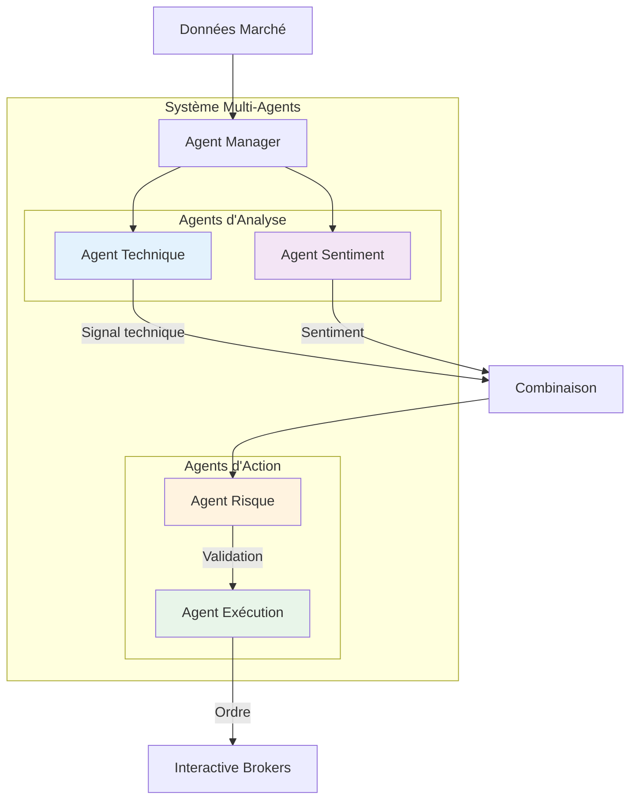
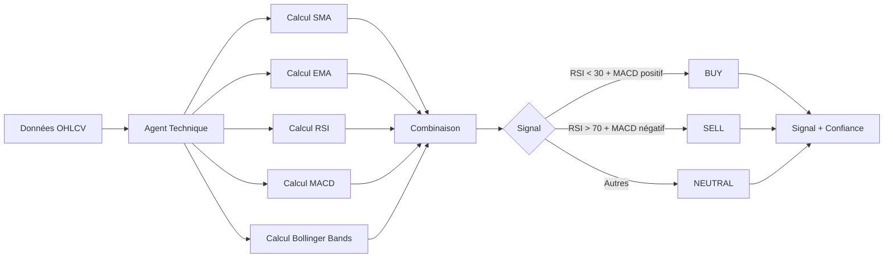
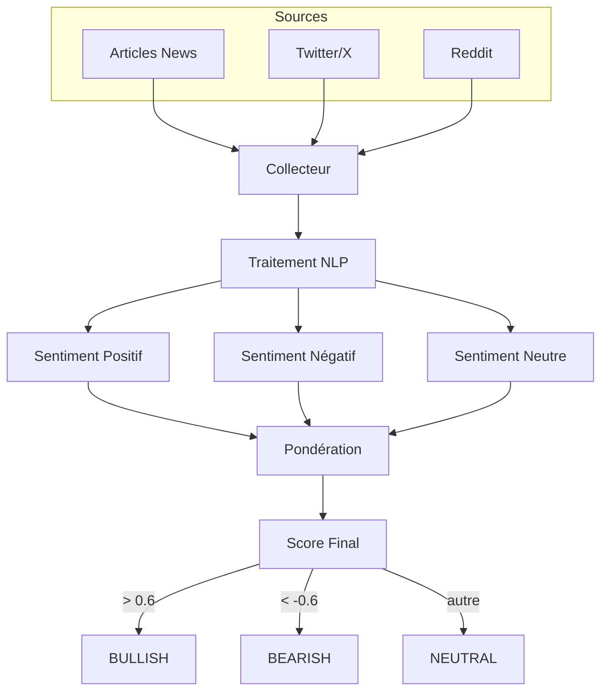
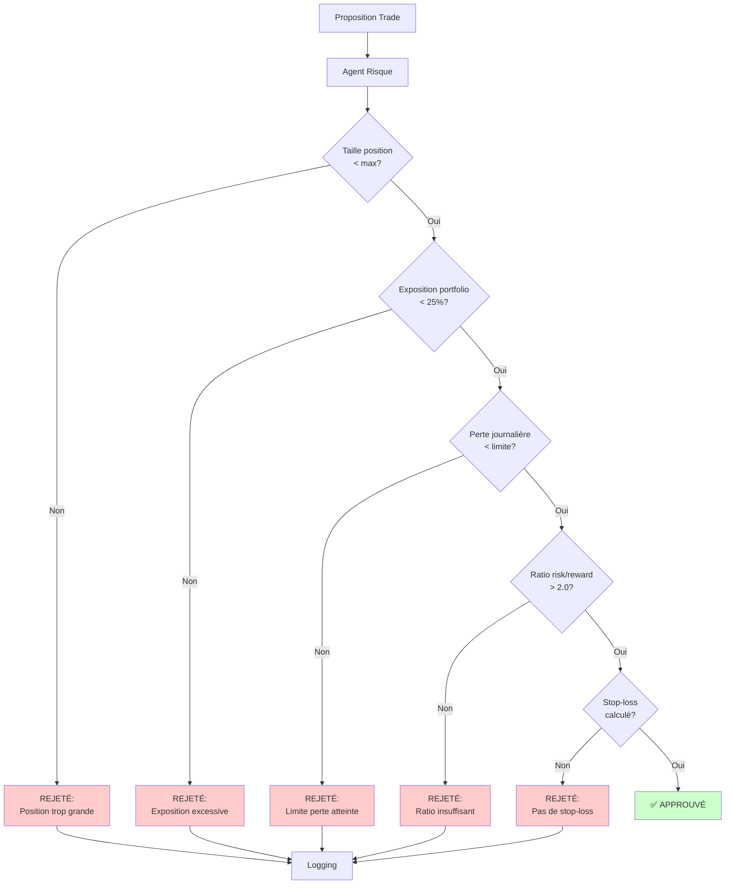
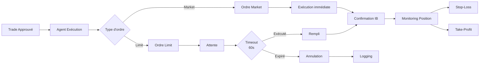
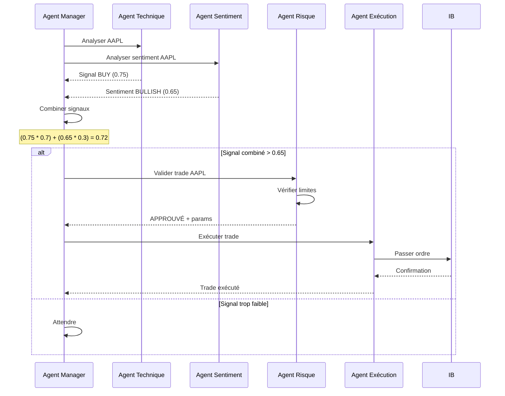
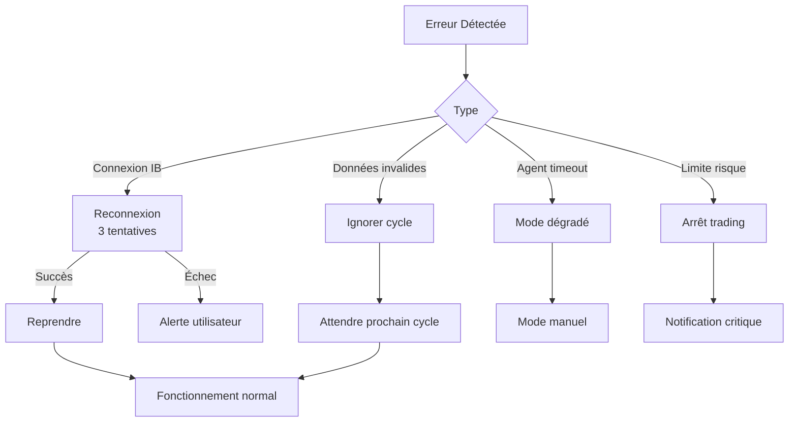

# Système Multi-Agents

[← Retour Architecture](./ARCHITECTURE.md)

## Vue d'ensemble

Le système Quantum Trader utilise une **architecture multi-agents** basée sur le framework **Swarm** d'OpenAI. Quatre agents spécialisés collaborent pour analyser, décider et exécuter des trades.



## Les 4 Agents

### 1. Agent d'Analyse Technique 📊

**Rôle** : Analyser les données de marché avec des indicateurs techniques



**Indicateurs utilisés** :
- **SMA** (20, 50, 200 périodes) : Tendance long terme
- **EMA** (12, 26) : Tendance court terme
- **RSI** (14) : Surachat/survente
- **MACD** : Momentum
- **Bollinger Bands** : Volatilité

**Sortie** :
```json
{
  "signal": "buy",      // buy, sell, ou neutral
  "confidence": 0.75,   // 0.0 à 1.0
  "indicators": {
    "rsi": 28.5,
    "macd": 0.45,
    "sma_20": 150.2,
    "bollinger_position": "lower"
  }
}
```

[→ Détails des indicateurs](./INDICATORS.md)

---

### 2. Agent d'Analyse de Sentiment 💬

**Rôle** : Évaluer le sentiment du marché via news et réseaux sociaux



**Sources analysées** :
- Articles de presse financière (60% poids)
- Twitter/X (20% poids)
- Reddit (20% poids)

**Configuration** :
```yaml
sentiment_analysis:
  news:
    update_interval: 300  # 5 minutes
    min_articles: 5
  social:
    platforms: ["twitter", "reddit"]
    min_mentions: 10
  weights:
    news: 0.6
    social: 0.4
```

**Sortie** :
```json
{
  "signal": "bullish",    // bullish, bearish, neutral
  "confidence": 0.65,
  "sources": {
    "news_count": 12,
    "social_mentions": 45,
    "overall_tone": "positive"
  }
}
```

[→ Documentation complète](./docs/sentiment_analysis.md)

---

### 3. Agent de Gestion des Risques 🛡️

**Rôle** : Valider chaque trade avant exécution



**Validations effectuées** :

1. **Taille de position**
   - Max : 100 actions par défaut
   - Configurable dans `config.yaml`

2. **Exposition du portfolio**
   - Max : 25% du capital total
   - Évite la sur-concentration

3. **Limite de perte journalière**
   - Max : $1000 par défaut
   - Arrêt automatique si atteint

4. **Ratio Risk/Reward**
   - Min : 2.0 (gain potentiel / perte potentielle)
   - Assure un trading profitable long terme

5. **Stop-Loss dynamique**
   - Calculé avec ATR (Average True Range)
   - Multiplié par 2 par défaut

**Sortie** :
```json
{
  "approved": true,
  "risk_parameters": {
    "position_size": "valid",
    "portfolio_exposure": "valid",
    "daily_loss": "valid",
    "risk_reward_ratio": "valid",
    "stop_loss": "calculated"
  },
  "calculated_stop_loss": 148.50,
  "position_size": 50
}
```

[→ Gestion des risques détaillée](./RISK_MANAGEMENT_DETAILED.md)

---

### 4. Agent d'Exécution ⚡

**Rôle** : Exécuter les trades validés sur Interactive Brokers



**Types d'ordres** :

| Type | Description | Usage |
|------|-------------|-------|
| **Market** | Exécution immédiate au prix marché | Urgence, forte liquidité |
| **Limit** | Exécution à un prix limite ou meilleur | Contrôle prix, faible slippage |

**Configuration** :
```yaml
execution:
  order_types: ["market", "limit"]
  default_order_type: "limit"
  limit_order_timeout: 60  # secondes
  slippage_tolerance: 0.001  # 0.1%
  position_sizing:
    method: "risk_based"  # ou "fixed_size"
    risk_per_trade: 0.01  # 1% du capital
```

**Gestion du Slippage** :
- Tolérance max : 0.1% par défaut
- Si slippage > tolérance → Annulation

**Sortie** :
```json
{
  "status": "executed",
  "order_id": "12345",
  "symbol": "AAPL",
  "quantity": 50,
  "price": 150.25,
  "timestamp": "2026-02-20T16:30:00Z",
  "stop_loss": 148.50,
  "take_profit": 154.00
}
```

---

## Communication Inter-Agents

Les agents communiquent via le framework **Swarm** :



## Pondération des Signaux

Les signaux des agents sont combinés avec des poids configurables :

```yaml
agent_system:
  signal_weights:
    technical: 0.7   # 70% du poids
    sentiment: 0.3   # 30% du poids
```

**Formule** :
```
Signal_Combiné = (Signal_Technique × 0.7) + (Signal_Sentiment × 0.3)
```

**Seuils de décision** :
```yaml
agent_system:
  confidence_thresholds:
    technical: 0.7    # Seuil min pour signal technique
    sentiment: 0.6    # Seuil min pour sentiment
    combined: 0.65    # Seuil min pour signal combiné
```

**Exemple** :
```
Signal Technique = 0.80 (BUY)
Signal Sentiment = 0.70 (BULLISH)

Signal Combiné = (0.80 × 0.7) + (0.70 × 0.3)
              = 0.56 + 0.21
              = 0.77

0.77 > 0.65 → Trade proposé ✅
```

## Gestion des Erreurs



## Fichiers Concernés

| Fichier | Responsabilité |
|---------|----------------|
| `src/trading/agents/agent_manager.py` | Gestionnaire principal des agents |
| `src/trading/agents/signal_analyzer.py` | Analyse et combinaison des signaux |
| `src/trading/agents/risk_validator.py` | Validation des risques |
| `src/trading/agents/trade_executor.py` | Exécution des ordres |
| `src/trading/agents/response_parser.py` | Parsing des réponses agents |
| `src/trading/trading_agents.py` | Système Swarm complet |

## Configuration Complète

```yaml
agent_system:
  update_interval: 60  # Secondes entre chaque cycle

  # Seuils de confiance minimum
  confidence_thresholds:
    technical: 0.7
    sentiment: 0.6
    combined: 0.65

  # Pondération des signaux
  signal_weights:
    technical: 0.7
    sentiment: 0.3

  # Timeout pour handoffs entre agents
  handoff_timeout: 30  # secondes
```

---

**Navigation**
- [← Architecture](./ARCHITECTURE.md)
- [→ Indicateurs Techniques](./INDICATORS.md)
- [→ Gestion des Risques](./RISK_MANAGEMENT_DETAILED.md)
- [→ Flux de Travail](./WORKFLOW.md)
