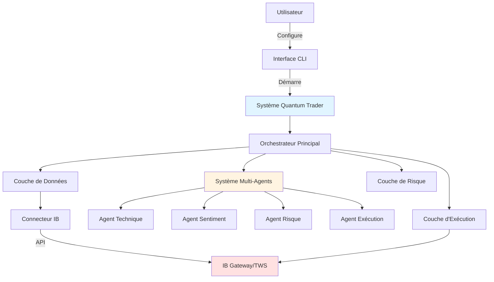
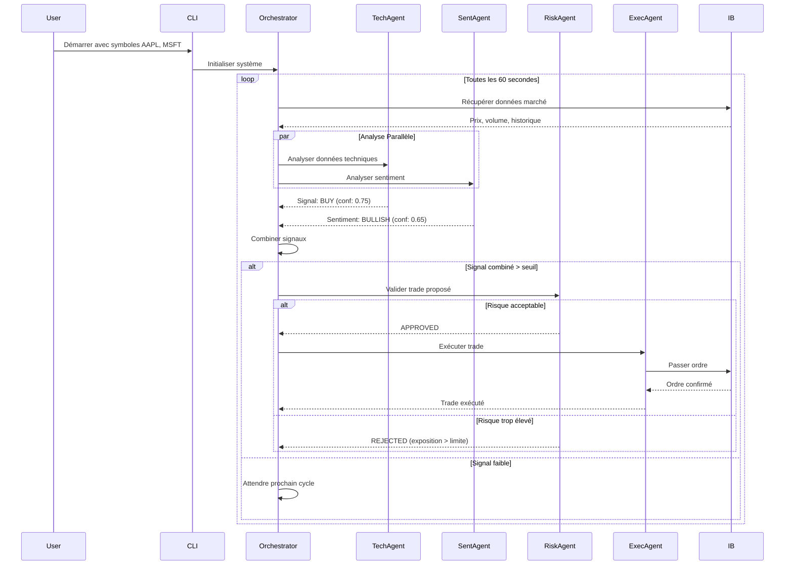
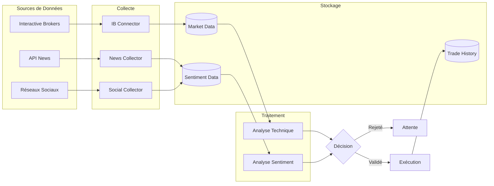
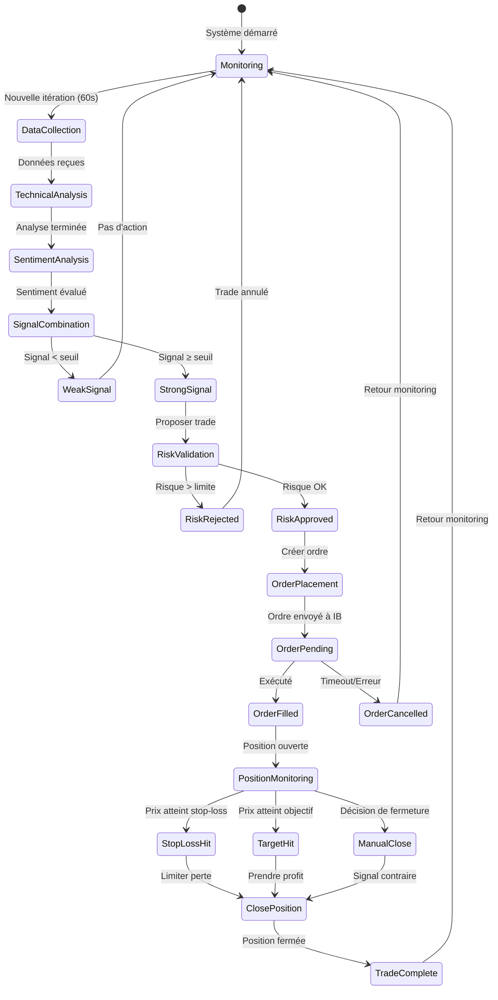
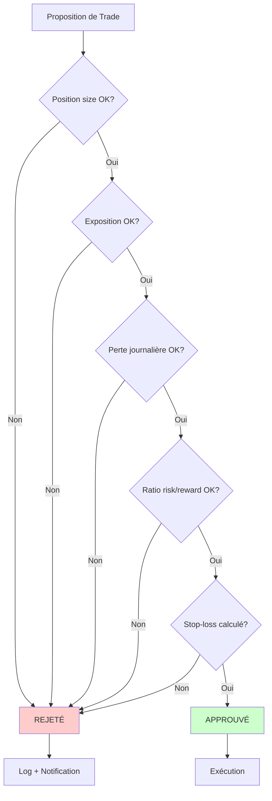

# Architecture Quantum Trader

## Vue d'ensemble

Quantum Trader est un système de trading algorithmique autonome qui utilise une **architecture multi-agents** pour analyser les marchés, gérer les risques et exécuter des trades automatiquement via Interactive Brokers.



## Composants Principaux

Le système est organisé en **5 couches** principales :

### 1. Interface Utilisateur
- **CLI Interface** : Interface ligne de commande pour démarrer et configurer le système
- **Dashboard** : Interface de monitoring en temps réel (optionnel)
- [Documentation CLI →](./docs/cli_interface.md)

### 2. Orchestrateur (Trading Logic)
- Coordonne tous les composants
- Gère le flux de décision
- Synchronise les agents
- [Détails Orchestrateur →](./ORCHESTRATOR.md)

### 3. Système Multi-Agents
- 4 agents spécialisés qui collaborent
- Communication via le framework Swarm (OpenAI)
- Chaque agent a un rôle spécifique
- [Architecture Agents →](./AGENTS_SYSTEM.md)

### 4. Analyseurs de Données
- **Analyse Technique** : Calcul d'indicateurs (RSI, MACD, Bollinger, etc.)
- **Analyse Qualitative** : Sentiment de marché (news, réseaux sociaux)
- [Indicateurs Techniques →](./INDICATORS.md)
- [Analyse de Sentiment →](./docs/sentiment_analysis.md)

### 5. Couches de Sécurité
- **Validation des Risques** : Vérification avant exécution
- **Gestion des Positions** : Limites de taille et exposition
- **Stop-Loss Dynamique** : Protection contre les pertes
- [Gestion des Risques →](./RISK_MANAGEMENT_DETAILED.md)

## Flux de Décision



## Architecture des Données



## Cycle de Vie d'un Trade



## Structure du Code

```
src/
├── api/                      # Connexion Interactive Brokers
│   └── ib_connector.py      # IBClient - Gestion API
│
├── analysis/                 # Moteurs d'analyse
│   ├── technical_analysis.py   # Calcul indicateurs techniques
│   └── qualitative_analysis.py # Analyse sentiment
│
├── trading/                  # Logique de trading
│   ├── trading_logic.py     # Orchestrateur principal
│   ├── trading_agents.py    # Système multi-agents (Swarm)
│   │
│   └── agents/              # Agents spécialisés
│       ├── agent_manager.py    # Gestionnaire d'agents
│       ├── signal_analyzer.py  # Analyse signaux
│       ├── risk_validator.py   # Validation risques
│       ├── trade_executor.py   # Exécution trades
│       └── response_parser.py  # Parsing réponses agents
│
├── cli/                      # Interfaces utilisateur
│   ├── cli_interface.py     # Interface ligne de commande
│   └── dashboard.py         # Dashboard temps réel
│
└── config/                   # Configuration
    └── config.yaml          # Paramètres du système
```

## Composants Clés

| Composant | Fichier | Description | Documentation |
|-----------|---------|-------------|---------------|
| **CLI Interface** | `cli/cli_interface.py` | Point d'entrée principal | [→ Détails](./docs/cli_interface.md) |
| **Trading Logic** | `trading/trading_logic.py` | Orchestrateur central | [→ Détails](./ORCHESTRATOR.md) |
| **Agent System** | `trading/trading_agents.py` | Coordination multi-agents | [→ Détails](./AGENTS_SYSTEM.md) |
| **IB Connector** | `api/ib_connector.py` | Communication avec IB | [→ Détails](./docs/ib_connector.md) |
| **Technical Analysis** | `analysis/technical_analysis.py` | Indicateurs techniques | [→ Détails](./INDICATORS.md) |
| **Risk Validator** | `trading/agents/risk_validator.py` | Gestion des risques | [→ Détails](./RISK_MANAGEMENT_DETAILED.md) |
| **Trade Executor** | `trading/agents/trade_executor.py` | Exécution ordres | [→ Détails](./EXECUTION.md) |

## Configuration

Le système est configuré via `src/config/config.yaml` :

```yaml
api:
  tws_endpoint: "127.0.0.1"
  port: 4002  # IB Gateway Paper Trading

risk_management:
  position_limits:
    max_position_size: 100
    max_portfolio_exposure: 0.25
  loss_limits:
    daily_loss_limit: 1000
    max_drawdown: 0.15

technical_analysis:
  indicators:
    sma_periods: [20, 50, 200]
    rsi:
      period: 14
      overbought: 70
      oversold: 30

agent_system:
  update_interval: 60  # secondes
  confidence_thresholds:
    technical: 0.7
    sentiment: 0.6
    combined: 0.65
```

[→ Configuration complète](./CONFIGURATION.md)

## Prochaines Étapes

1. **[Comprendre le système multi-agents](./AGENTS_SYSTEM.md)** - Architecture des agents
2. **[Découvrir les indicateurs techniques](./INDICATORS.md)** - RSI, MACD, Bollinger Bands
3. **[Apprendre la gestion des risques](./RISK_MANAGEMENT_DETAILED.md)** - Limites et protections
4. **[Voir le flux de travail complet](./WORKFLOW.md)** - De l'analyse à l'exécution
5. **[Configurer le système](./CONFIGURATION.md)** - Personnaliser les paramètres

## Modes d'Exécution

### Mode Paper Trading (Recommandé)
- Utilise un compte de démonstration IB
- Aucun argent réel n'est risqué
- Parfait pour tester et apprendre
- Port par défaut : **4002**

### Mode Live Trading (ATTENTION)
- Utilise un compte réel
- Trades avec de l'argent réel
- Nécessite une validation stricte
- Port par défaut : **4001**

## Sécurité et Contrôles



---

**Navigation**
- [Système Multi-Agents →](./AGENTS_SYSTEM.md)
- [Indicateurs Techniques →](./INDICATORS.md)
- [Gestion des Risques →](./RISK_MANAGEMENT_DETAILED.md)
- [Flux de Travail →](./WORKFLOW.md)
- [Configuration →](./CONFIGURATION.md)
