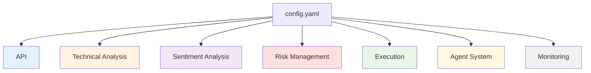
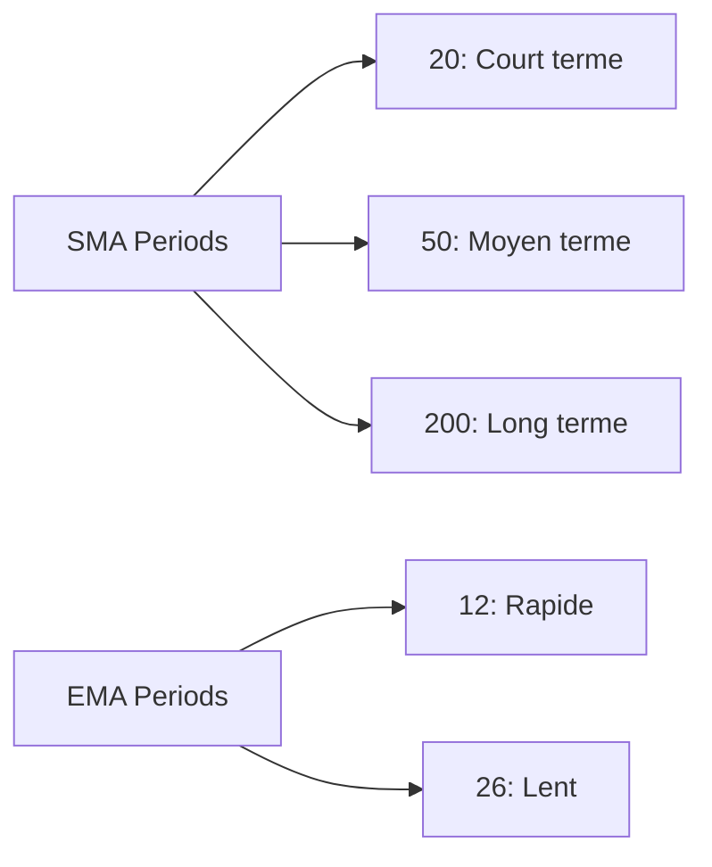
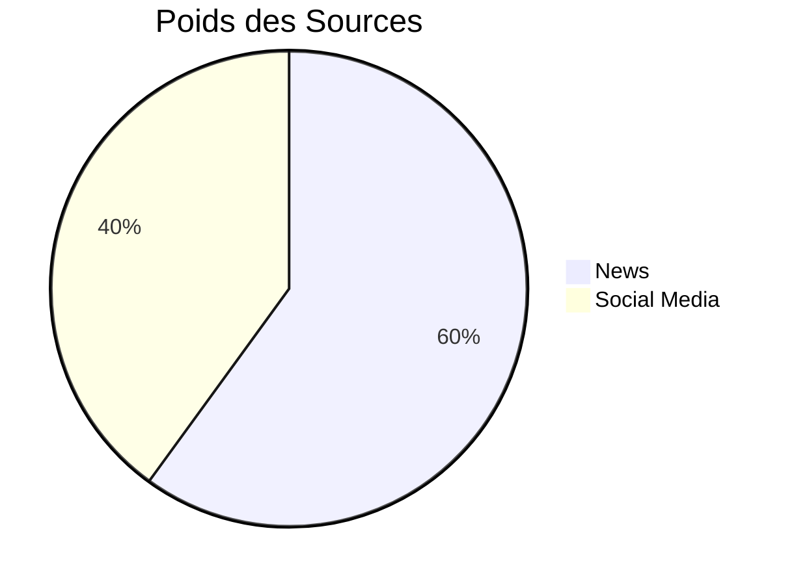
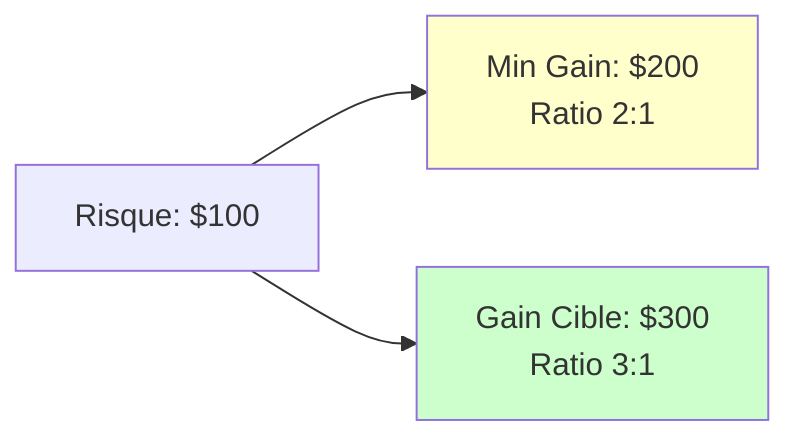
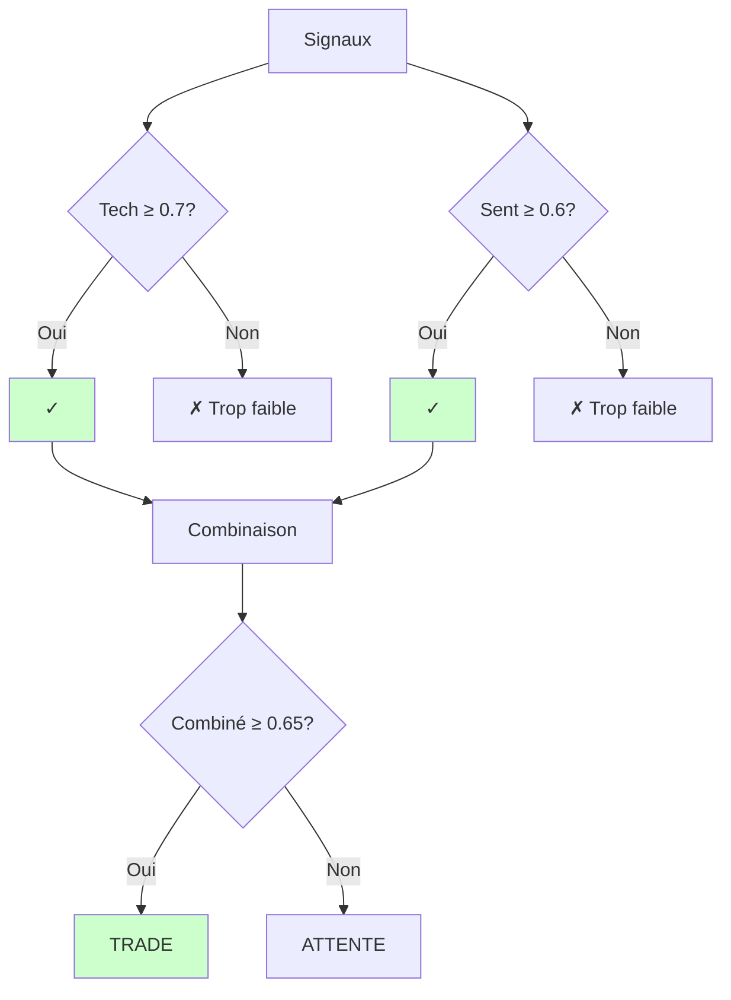

# Guide de Configuration

[← Retour Architecture](./ARCHITECTURE.md)

## Vue d'ensemble

Le système Quantum Trader est entièrement configurable via le fichier `src/config/config.yaml`. Ce guide explique chaque paramètre en détail.

---

## Structure du Fichier



---

## 1. Configuration API

### Connexion Interactive Brokers

```yaml
api:
  tws_endpoint: "127.0.0.1"
  port: 4002
```

| Paramètre | Description | Valeurs possibles |
|-----------|-------------|-------------------|
| `tws_endpoint` | Adresse IP du serveur IB | `127.0.0.1` (local)<br>`192.168.x.x` (réseau) |
| `port` | Port de connexion | **4002** : IB Gateway Paper<br>**4001** : IB Gateway Live<br>**7497** : TWS Paper<br>**7496** : TWS Live |

### Exemples

```yaml
# Configuration actuelle (IB Gateway Paper Trading)
api:
  tws_endpoint: "127.0.0.1"
  port: 4002

# TWS Paper Trading
api:
  tws_endpoint: "127.0.0.1"
  port: 7497

# IB Gateway Live (ATTENTION: argent réel!)
api:
  tws_endpoint: "127.0.0.1"
  port: 4001
```

---

## 2. Analyse Technique

### Configuration des Indicateurs

```yaml
technical_analysis:
  indicators:
    sma_periods: [20, 50, 200]
    ema_periods: [12, 26]

    rsi:
      period: 14
      overbought: 70
      oversold: 30

    macd:
      fast_period: 12
      slow_period: 26
      signal_period: 9

    bollinger_bands:
      period: 20
      std_dev: 2

    volume_ma_period: 20
```

### SMA/EMA



| Paramètre | Par défaut | Recommandé | Description |
|-----------|------------|------------|-------------|
| `sma_periods` | [20, 50, 200] | [20, 50, 200] | Périodes pour moyennes mobiles simples |
| `ema_periods` | [12, 26] | [12, 26] | Pour calcul MACD |

**Personnalisation** :
```yaml
# Trading court terme
sma_periods: [10, 20, 50]

# Trading long terme
sma_periods: [50, 100, 200]
```

### RSI (Relative Strength Index)

| Paramètre | Par défaut | Plage | Description |
|-----------|------------|-------|-------------|
| `period` | 14 | 7-21 | Nombre de périodes pour calcul |
| `overbought` | 70 | 70-80 | Seuil de surachat |
| `oversold` | 30 | 20-30 | Seuil de survente |

**Personnalisation** :
```yaml
# Trading agressif
rsi:
  period: 9
  overbought: 75
  oversold: 25

# Trading conservateur
rsi:
  period: 21
  overbought: 65
  oversold: 35
```

### MACD

| Paramètre | Par défaut | Description |
|-----------|------------|-------------|
| `fast_period` | 12 | EMA rapide |
| `slow_period` | 26 | EMA lente |
| `signal_period` | 9 | EMA du MACD |

**Valeurs standards** : Ne changez que si vous savez ce que vous faites !

### Bollinger Bands

| Paramètre | Par défaut | Plage | Description |
|-----------|------------|-------|-------------|
| `period` | 20 | 15-30 | Période pour SMA centrale |
| `std_dev` | 2 | 1.5-2.5 | Nombre d'écarts-types |

**Personnalisation** :
```yaml
# Bandes plus serrées (plus de signaux)
bollinger_bands:
  period: 20
  std_dev: 1.5

# Bandes plus larges (signaux plus rares mais fiables)
bollinger_bands:
  period: 20
  std_dev: 2.5
```

---

## 3. Analyse de Sentiment

```yaml
sentiment_analysis:
  news:
    update_interval: 300      # 5 minutes
    lookback_period: 86400    # 24 heures
    min_articles: 5

  social:
    update_interval: 180      # 3 minutes
    platforms: ["twitter", "reddit"]
    min_mentions: 10

  weights:
    news: 0.6
    social: 0.4
```

### News

| Paramètre | Par défaut | Description |
|-----------|------------|-------------|
| `update_interval` | 300 | Fréquence MAJ (secondes) |
| `lookback_period` | 86400 | Période historique (secondes) |
| `min_articles` | 5 | Minimum d'articles requis |

### Social Media

| Paramètre | Par défaut | Options |
|-----------|------------|---------|
| `platforms` | ["twitter", "reddit"] | twitter, reddit |
| `min_mentions` | 10 | Minimum de mentions |

### Pondération



**Personnalisation** :
```yaml
# Plus de poids aux news professionnelles
weights:
  news: 0.8
  social: 0.2

# Équilibré
weights:
  news: 0.5
  social: 0.5
```

---

## 4. Gestion des Risques ⚠️

### Limites de Position

```yaml
risk_management:
  position_limits:
    max_position_size: 100
    max_portfolio_exposure: 0.25
```

| Paramètre | Par défaut | Description | Impact |
|-----------|------------|-------------|--------|
| `max_position_size` | 100 | Max actions par position | Protection sur-concentration |
| `max_portfolio_exposure` | 0.25 | Max 25% du capital exposé | Diversification |

**Ajustement selon capital** :

```yaml
# Petit capital ($10k-$50k)
position_limits:
  max_position_size: 50
  max_portfolio_exposure: 0.20

# Capital moyen ($50k-$200k)
position_limits:
  max_position_size: 100
  max_portfolio_exposure: 0.25

# Gros capital ($200k+)
position_limits:
  max_position_size: 200
  max_portfolio_exposure: 0.30
```

### Limites de Perte

```yaml
risk_management:
  loss_limits:
    daily_loss_limit: 1000
    max_drawdown: 0.15
```

| Paramètre | Par défaut | Description |
|-----------|------------|-------------|
| `daily_loss_limit` | 1000 | Max perte/jour ($) |
| `max_drawdown` | 0.15 | Max drawdown (15%) |

**IMPORTANT** : Ajustez selon votre capital !

```yaml
# Capital $10,000
loss_limits:
  daily_loss_limit: 100    # 1% du capital
  max_drawdown: 0.10       # 10%

# Capital $100,000
loss_limits:
  daily_loss_limit: 1000   # 1% du capital
  max_drawdown: 0.15       # 15%
```

### Fréquence de Trading

```yaml
risk_management:
  trade_frequency:
    min_time_between_trades: 300  # 5 minutes
    max_daily_trades: 10
```

| Paramètre | Par défaut | Description |
|-----------|------------|-------------|
| `min_time_between_trades` | 300 | Délai min entre trades (s) |
| `max_daily_trades` | 10 | Max trades par jour |

### Stop-Loss

```yaml
risk_management:
  stop_loss:
    atr_multiplier: 2
    max_loss_per_trade: 0.02
```

| Paramètre | Par défaut | Plage | Description |
|-----------|------------|-------|-------------|
| `atr_multiplier` | 2 | 1.5-3 | Distance stop = ATR × multiplicateur |
| `max_loss_per_trade` | 0.02 | 0.01-0.05 | Max 2% du capital par trade |

**Ajustement par style de trading** :

```yaml
# Trading conservateur
stop_loss:
  atr_multiplier: 1.5    # Stop serré
  max_loss_per_trade: 0.01

# Trading équilibré (défaut)
stop_loss:
  atr_multiplier: 2
  max_loss_per_trade: 0.02

# Trading agressif
stop_loss:
  atr_multiplier: 3      # Stop large
  max_loss_per_trade: 0.03
```

### Ratio Risk/Reward

```yaml
risk_management:
  risk_reward:
    min_ratio: 2.0
    target_ratio: 3.0
```

| Paramètre | Par défaut | Description |
|-----------|------------|-------------|
| `min_ratio` | 2.0 | Minimum acceptable |
| `target_ratio` | 3.0 | Objectif idéal |



---

## 5. Exécution des Trades

```yaml
execution:
  order_types: ["market", "limit"]
  default_order_type: "limit"
  limit_order_timeout: 60
  slippage_tolerance: 0.001

  position_sizing:
    method: "risk_based"
    risk_per_trade: 0.01
    default_size: 10
```

### Types d'Ordres

| Paramètre | Par défaut | Options |
|-----------|------------|---------|
| `order_types` | ["market", "limit"] | market, limit, stop |
| `default_order_type` | "limit" | market ou limit |
| `limit_order_timeout` | 60 | Secondes avant annulation |
| `slippage_tolerance` | 0.001 | 0.1% max |

**Comparaison** :

| Type | Avantages | Inconvénients | Usage |
|------|-----------|---------------|-------|
| **Market** | Exécution garantie | Slippage possible | Urgence, haute liquidité |
| **Limit** | Prix garanti | Peut ne pas s'exécuter | Contrôle, faible liquidité |

### Taille de Position

```yaml
position_sizing:
  method: "risk_based"      # ou "fixed_size"
  risk_per_trade: 0.01      # 1% du capital
  default_size: 10          # Si fixed_size
```

**Méthodes** :

1. **risk_based** (Recommandé)
   ```python
   # Calcule automatiquement selon le risque
   capital = 100_000
   risk = 0.01  # 1%
   stop_distance = 5  # $5 par action

   quantite = (capital * risk) / stop_distance
   # = (100_000 × 0.01) / 5 = 200 actions
   ```

2. **fixed_size**
   ```python
   # Taille fixe à chaque fois
   quantite = default_size  # 10 actions
   ```

---

## 6. Système Multi-Agents

```yaml
agent_system:
  update_interval: 60

  confidence_thresholds:
    technical: 0.7
    sentiment: 0.6
    combined: 0.65

  signal_weights:
    technical: 0.7
    sentiment: 0.3

  handoff_timeout: 30
```

### Seuils de Confiance



| Paramètre | Par défaut | Recommandé | Description |
|-----------|------------|------------|-------------|
| `technical` | 0.7 | 0.6-0.8 | Seuil signal technique |
| `sentiment` | 0.6 | 0.5-0.7 | Seuil sentiment |
| `combined` | 0.65 | 0.6-0.75 | Seuil signal final |

**Ajustement par tolérance** :

```yaml
# Agressif (plus de trades)
confidence_thresholds:
  technical: 0.6
  sentiment: 0.5
  combined: 0.55

# Conservateur (moins de trades, plus fiables)
confidence_thresholds:
  technical: 0.8
  sentiment: 0.7
  combined: 0.75
```

### Pondération des Signaux

```yaml
signal_weights:
  technical: 0.7    # 70%
  sentiment: 0.3    # 30%
```

**Stratégies** :

```yaml
# Privilégier technique
signal_weights:
  technical: 0.8
  sentiment: 0.2

# Équilibré
signal_weights:
  technical: 0.5
  sentiment: 0.5

# Privilégier sentiment
signal_weights:
  technical: 0.3
  sentiment: 0.7
```

---

## 7. Monitoring

```yaml
monitoring:
  log_level: "INFO"
  metrics_interval: 300
  save_trades: true
  save_signals: true
```

| Paramètre | Options | Description |
|-----------|---------|-------------|
| `log_level` | DEBUG, INFO, WARNING, ERROR | Niveau de détail logs |
| `metrics_interval` | 300 (5 min) | Fréquence MAJ métriques |
| `save_trades` | true/false | Sauvegarder historique trades |
| `save_signals` | true/false | Sauvegarder signaux |

---

## Configuration Complète Annotée

```yaml
# ============================================================
# QUANTUM TRADER - Configuration Complète
# ============================================================

# Connexion Interactive Brokers
api:
  tws_endpoint: "127.0.0.1"
  port: 4002  # 4002=Gateway Paper, 4001=Gateway Live

# Analyse Technique
technical_analysis:
  indicators:
    sma_periods: [20, 50, 200]  # Court, Moyen, Long terme
    ema_periods: [12, 26]        # Pour MACD

    rsi:
      period: 14        # Standard
      overbought: 70    # Seuil surachat
      oversold: 30      # Seuil survente

    macd:
      fast_period: 12
      slow_period: 26
      signal_period: 9

    bollinger_bands:
      period: 20
      std_dev: 2        # Écarts-types

    volume_ma_period: 20

# Analyse Sentiment
sentiment_analysis:
  news:
    update_interval: 300      # 5 minutes
    lookback_period: 86400    # 24 heures
    min_articles: 5

  social:
    update_interval: 180      # 3 minutes
    platforms: ["twitter", "reddit"]
    min_mentions: 10

  weights:
    news: 0.6
    social: 0.4

# Gestion des Risques (CRITIQUE!)
risk_management:
  position_limits:
    max_position_size: 100        # Actions max/position
    max_portfolio_exposure: 0.25  # 25% capital max

  loss_limits:
    daily_loss_limit: 1000        # $ max perte/jour
    max_drawdown: 0.15            # 15% drawdown max

  trade_frequency:
    min_time_between_trades: 300  # 5 min entre trades
    max_daily_trades: 10          # 10 trades max/jour

  stop_loss:
    atr_multiplier: 2             # Distance stop = ATR × 2
    max_loss_per_trade: 0.02      # 2% max/trade

  risk_reward:
    min_ratio: 2.0                # Minimum 2:1
    target_ratio: 3.0             # Idéal 3:1

# Exécution
execution:
  order_types: ["market", "limit"]
  default_order_type: "limit"
  limit_order_timeout: 60         # Secondes
  slippage_tolerance: 0.001       # 0.1%

  position_sizing:
    method: "risk_based"          # ou "fixed_size"
    risk_per_trade: 0.01          # 1% capital
    default_size: 10              # Si fixed_size

# Système Multi-Agents
agent_system:
  update_interval: 60             # Cycle toutes les 60s

  confidence_thresholds:
    technical: 0.7
    sentiment: 0.6
    combined: 0.65

  signal_weights:
    technical: 0.7
    sentiment: 0.3

  handoff_timeout: 30

# Monitoring
monitoring:
  log_level: "INFO"
  metrics_interval: 300
  save_trades: true
  save_signals: true
```

---

## Profils Recommandés

### Débutant (Conservateur)

```yaml
risk_management:
  position_limits:
    max_position_size: 50
    max_portfolio_exposure: 0.20

  loss_limits:
    daily_loss_limit: 200
    max_drawdown: 0.10

  stop_loss:
    atr_multiplier: 1.5
    max_loss_per_trade: 0.01

agent_system:
  confidence_thresholds:
    technical: 0.8
    sentiment: 0.7
    combined: 0.75
```

### Intermédiaire (Équilibré)

```yaml
# Utiliser configuration par défaut
```

### Avancé (Agressif)

```yaml
risk_management:
  position_limits:
    max_position_size: 200
    max_portfolio_exposure: 0.30

  loss_limits:
    daily_loss_limit: 2000
    max_drawdown: 0.20

  stop_loss:
    atr_multiplier: 3
    max_loss_per_trade: 0.03

agent_system:
  confidence_thresholds:
    technical: 0.6
    sentiment: 0.5
    combined: 0.55
```

---

**Navigation**
- [← Architecture](./ARCHITECTURE.md)
- [← Workflow](./WORKFLOW.md)
- [→ Index Documentation](./INDEX_DOCS.md)
