# Indicateurs Techniques

[← Retour Architecture](./ARCHITECTURE.md)

## Vue d'ensemble

Le système utilise **5 indicateurs techniques** principaux pour analyser les marchés et générer des signaux de trading.

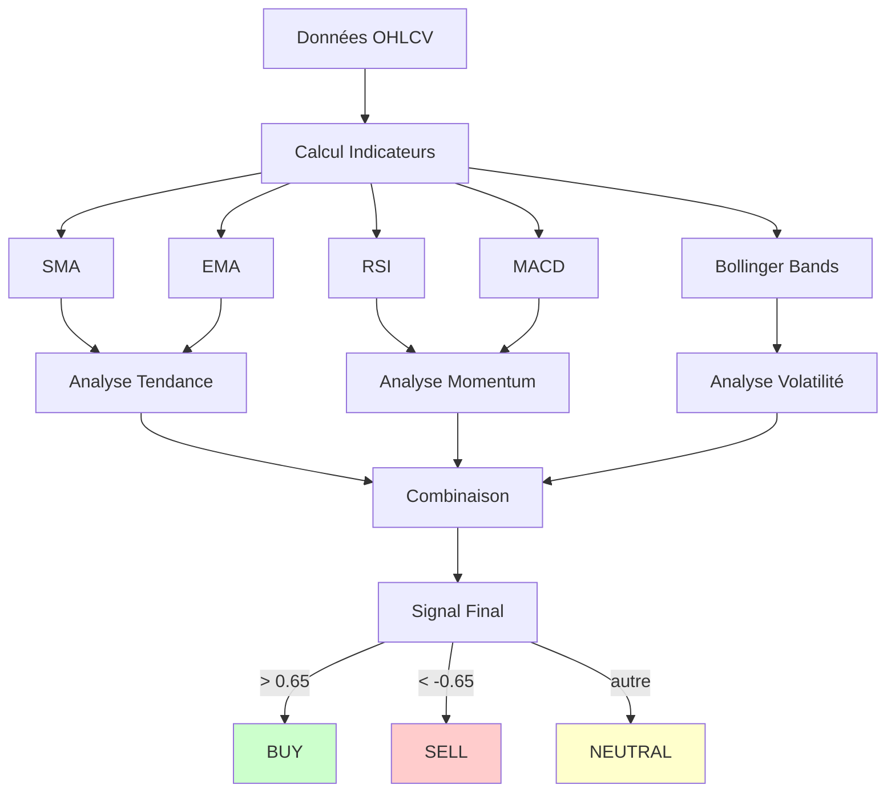

## 1. SMA (Simple Moving Average) 📈

**Description** : Moyenne mobile simple, indique la tendance générale du prix.

### Calcul

```
SMA(n) = (Prix₁ + Prix₂ + ... + Prixₙ) / n
```

### Périodes utilisées

- **SMA 20** : Tendance court terme (1 mois)
- **SMA 50** : Tendance moyen terme (2.5 mois)
- **SMA 200** : Tendance long terme (1 an)

### Interprétation

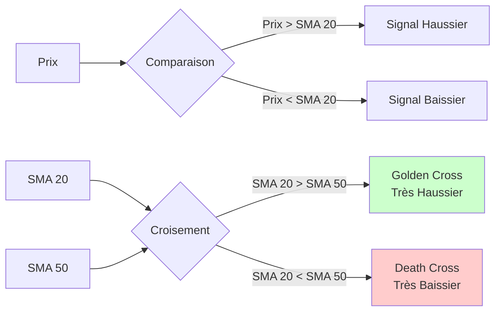

### Signaux

| Condition | Signal | Force |
|-----------|--------|-------|
| Prix > SMA 20 > SMA 50 > SMA 200 | Très haussier | +++++ |
| Prix > SMA 20 > SMA 50 | Haussier | +++ |
| Prix > SMA 20 | Faiblement haussier | + |
| Prix < SMA 20 | Faiblement baissier | - |
| Prix < SMA 20 < SMA 50 | Baissier | --- |
| Prix < SMA 20 < SMA 50 < SMA 200 | Très baissier | ----- |

### Configuration

```yaml
technical_analysis:
  indicators:
    sma_periods: [20, 50, 200]
```

---

## 2. EMA (Exponential Moving Average) ⚡

**Description** : Moyenne mobile exponentielle, réagit plus rapidement aux changements de prix que la SMA.

### Calcul

```
EMA(aujourd'hui) = (Prix × Multiplicateur) + (EMA(hier) × (1 - Multiplicateur))

Multiplicateur = 2 / (Période + 1)
```

### Périodes utilisées

- **EMA 12** : Court terme (2.5 semaines)
- **EMA 26** : Moyen terme (5 semaines)

### Différence avec SMA

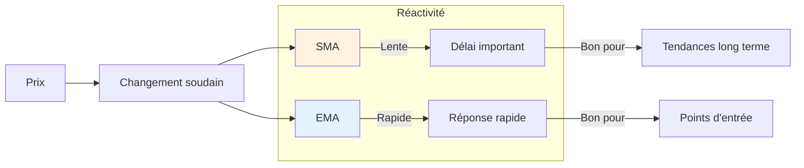

### Signaux

| Condition | Signal |
|-----------|--------|
| EMA 12 croise au-dessus EMA 26 | ACHAT (Signal haussier) |
| EMA 12 croise en-dessous EMA 26 | VENTE (Signal baissier) |
| EMA 12 > EMA 26 (écart croissant) | Tendance haussière forte |
| EMA 12 < EMA 26 (écart croissant) | Tendance baissière forte |

---

## 3. RSI (Relative Strength Index) 🎯

**Description** : Indicateur de momentum qui mesure la vitesse et l'amplitude des mouvements de prix. Identifie les conditions de surachat et survente.

### Calcul

```
RSI = 100 - (100 / (1 + RS))

RS = Moyenne des gains / Moyenne des pertes (sur n périodes)
```

### Zones

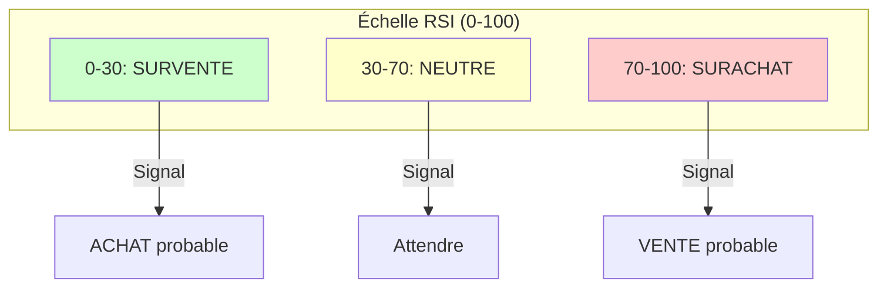

### Interprétation

| RSI | Condition | Signal |
|-----|-----------|--------|
| < 30 | **Survente** | Signal d'achat (prix anormalement bas) |
| 30-40 | Faible | Potentiel d'achat |
| 40-60 | Neutre | Pas de signal clair |
| 60-70 | Élevé | Potentiel de vente |
| > 70 | **Surachat** | Signal de vente (prix anormalement haut) |

### Divergences

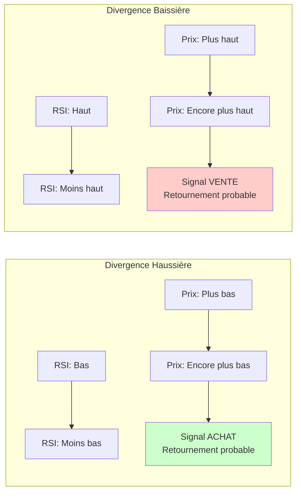

### Configuration

```yaml
technical_analysis:
  indicators:
    rsi:
      period: 14
      overbought: 70
      oversold: 30
```

---

## 4. MACD (Moving Average Convergence Divergence) 📊

**Description** : Indicateur de momentum basé sur la différence entre deux moyennes mobiles. Excellent pour identifier les retournements de tendance.

### Composantes

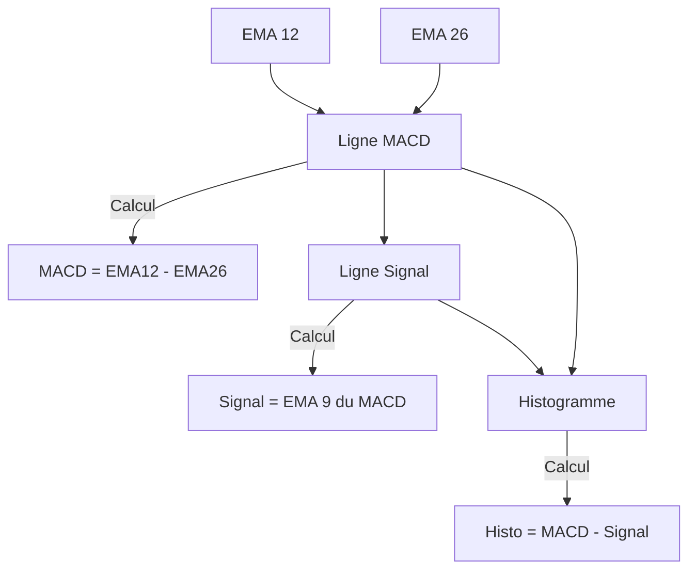

### Calcul

```
MACD Line = EMA(12) - EMA(26)
Signal Line = EMA(9) du MACD
Histogramme = MACD Line - Signal Line
```

### Signaux

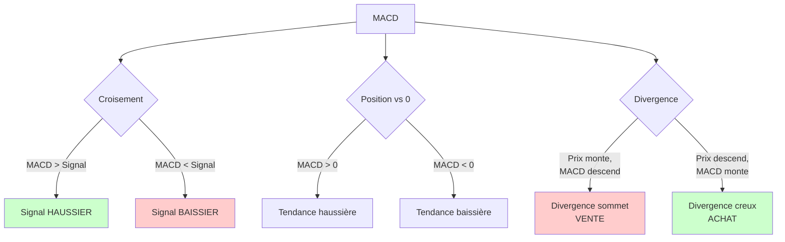

### Interprétation

| Condition | Signal | Force |
|-----------|--------|-------|
| MACD croise au-dessus Signal | ACHAT | +++ |
| MACD croise en-dessous Signal | VENTE | --- |
| Histogramme croissant | Momentum haussier | ++ |
| Histogramme décroissant | Momentum baissier | -- |
| MACD > 0 et croissant | Tendance haussière forte | ++++ |
| MACD < 0 et décroissant | Tendance baissière forte | ---- |

### Configuration

```yaml
technical_analysis:
  indicators:
    macd:
      fast_period: 12
      slow_period: 26
      signal_period: 9
```

---

## 5. Bollinger Bands (Bandes de Bollinger) 🎚️

**Description** : Indicateur de volatilité composé de 3 bandes. Identifie les périodes de forte/faible volatilité et les points de retournement potentiels.

### Structure

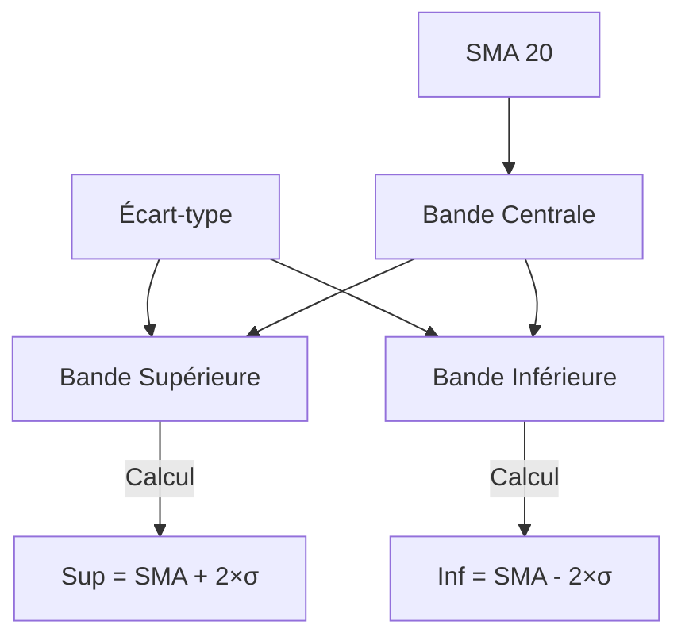

### Calcul

```
Bande Centrale = SMA(20)
Bande Supérieure = SMA(20) + (2 × Écart-type)
Bande Inférieure = SMA(20) - (2 × Écart-type)
```

### Interprétation

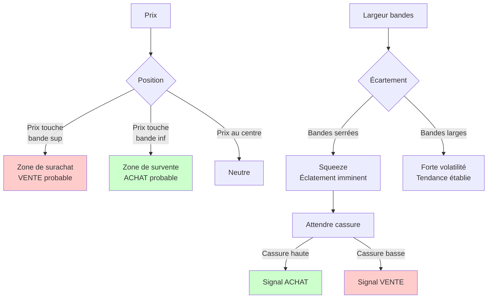

### Signaux

| Condition | Signal |
|-----------|--------|
| Prix touche bande inférieure | Survente → ACHAT probable |
| Prix touche bande supérieure | Surachat → VENTE probable |
| Prix rebondit sur bande centrale | Continuation tendance |
| Bandes se resserrent | Volatilité faible → Éclatement imminent |
| Bandes s'élargissent | Volatilité forte → Tendance en cours |

### Stratégie Squeeze

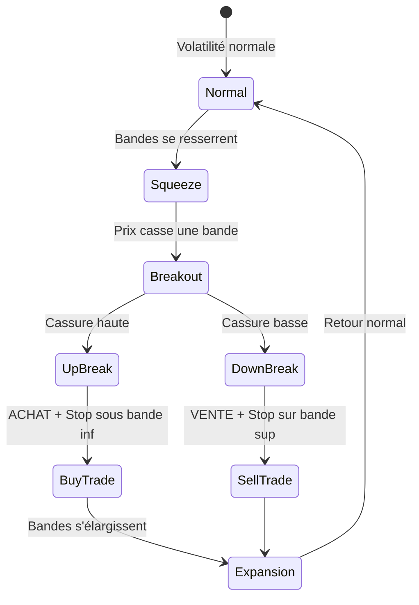

### Configuration

```yaml
technical_analysis:
  indicators:
    bollinger_bands:
      period: 20
      std_dev: 2  # Nombre d'écarts-types
```

---

## Combinaison des Indicateurs

Le système combine tous les indicateurs pour générer un signal final :

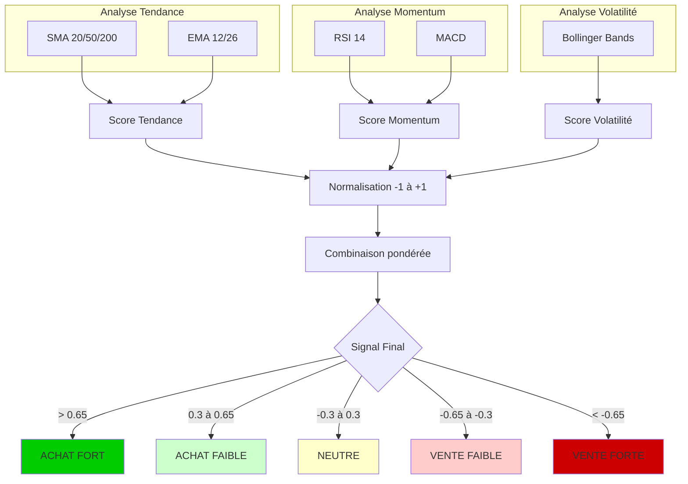

### Formule de Combinaison

```python
# Normalisation RSI
rsi_signal = (rsi_value - 50) / 50  # -1 à +1

# Normalisation MACD
macd_signal = tanh(macd_value)  # -1 à +1

# Position Bollinger
bb_position = (prix - bande_inf) / (bande_sup - bande_inf)
bb_signal = 2 * (bb_position - 0.5)  # -1 à +1

# Signal combiné
signal_final = (rsi_signal + macd_signal + bb_signal) / 3
```

### Poids par Indicateur

| Indicateur | Poids | Justification |
|------------|-------|---------------|
| SMA/EMA | 30% | Tendance générale |
| RSI | 25% | Surachat/survente |
| MACD | 25% | Momentum et retournements |
| Bollinger | 20% | Volatilité et extrêmes |

---

## Visualisation des Signaux

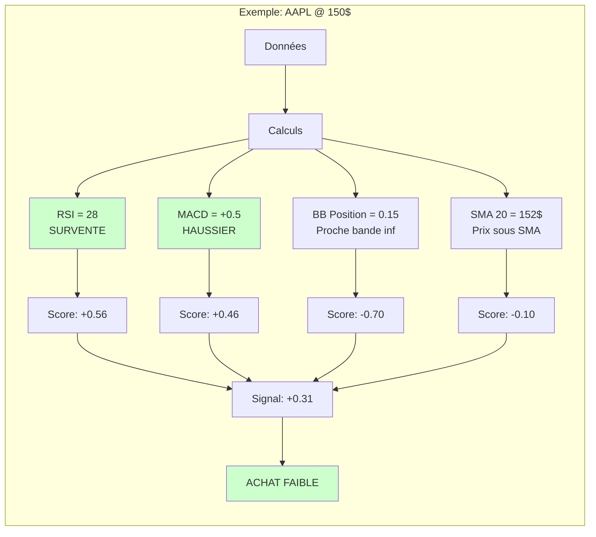

---

## Implémentation

### Fichier source

`src/analysis/technical_analysis.py`

### Classes et méthodes

```python
class TechnicalAnalysis:
    def __init__(self, data: pd.DataFrame)

    # Moyennes mobiles
    def sma(self, period: int) -> pd.Series
    def ema(self, period: int) -> pd.Series

    # Momentum
    def rsi(self, period: int = 14) -> pd.Series
    def macd(self, fast: int = 12, slow: int = 26, signal: int = 9) -> tuple

    # Volatilité
    def bollinger_bands(self, period: int = 20, std_dev: int = 2) -> tuple

    # Évaluation globale
    def evaluate(self, market_data: pd.DataFrame) -> float
```

---

**Navigation**
- [← Architecture](./ARCHITECTURE.md)
- [← Système Multi-Agents](./AGENTS_SYSTEM.md)
- [→ Gestion des Risques](./RISK_MANAGEMENT_DETAILED.md)
- [→ Flux de Travail](./WORKFLOW.md)
