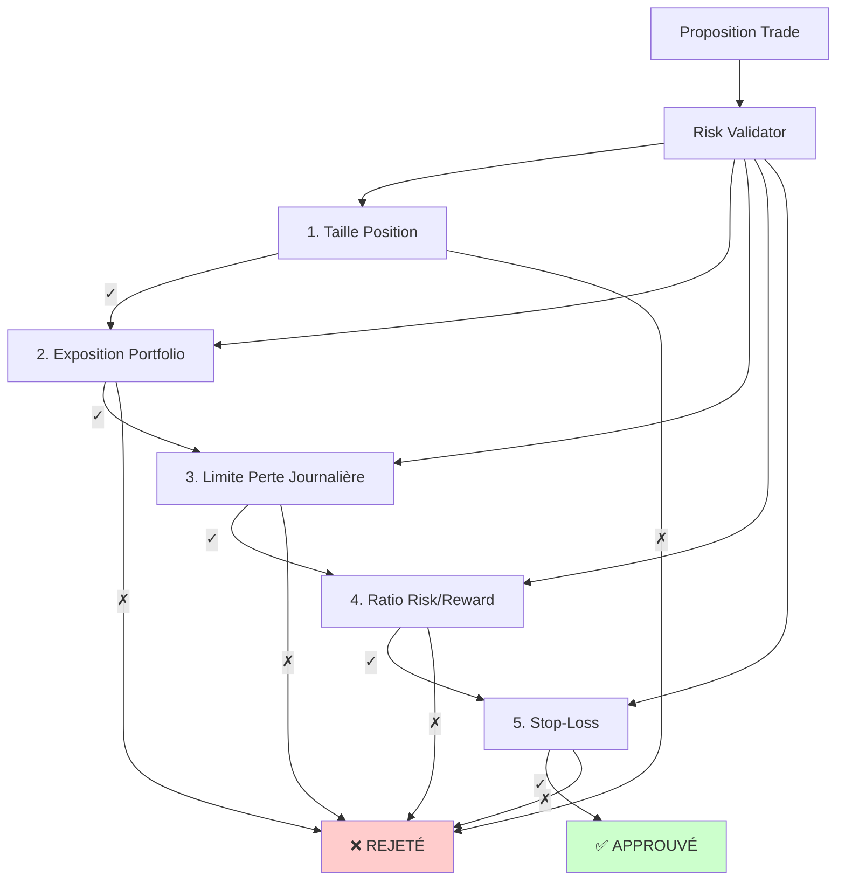
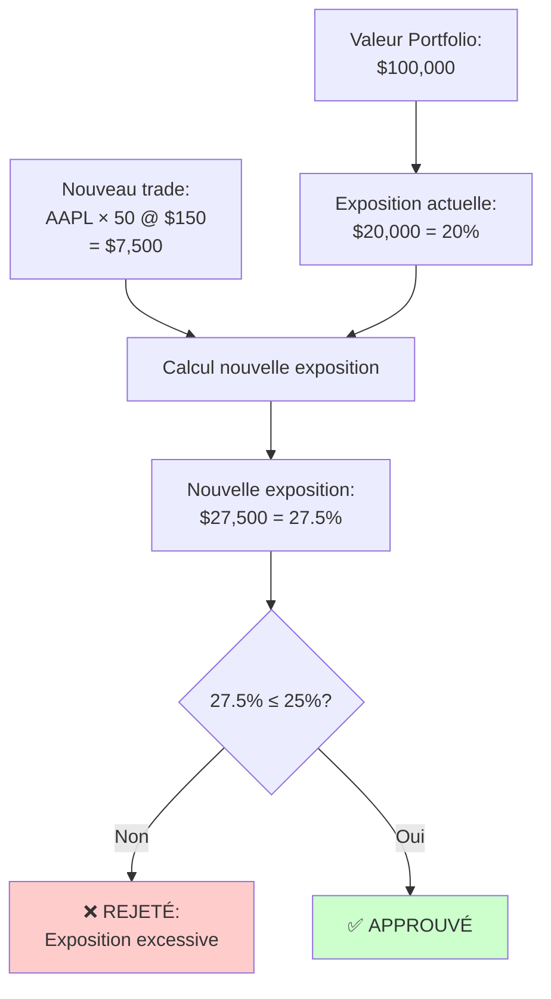
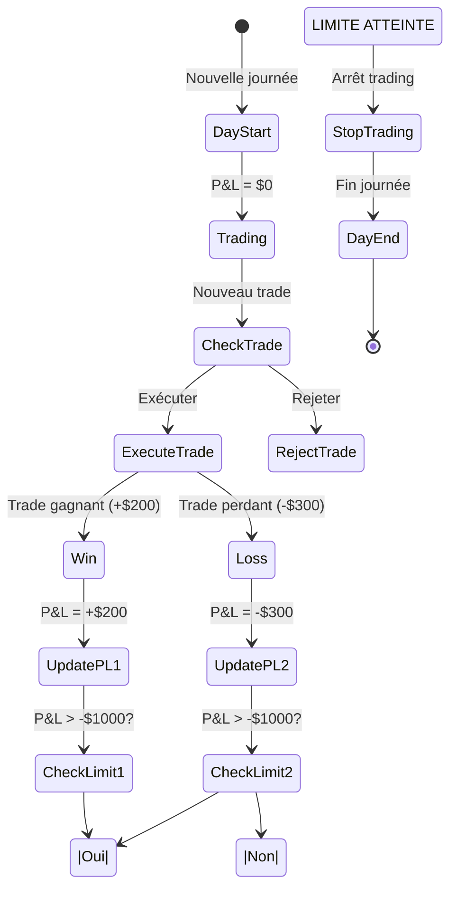
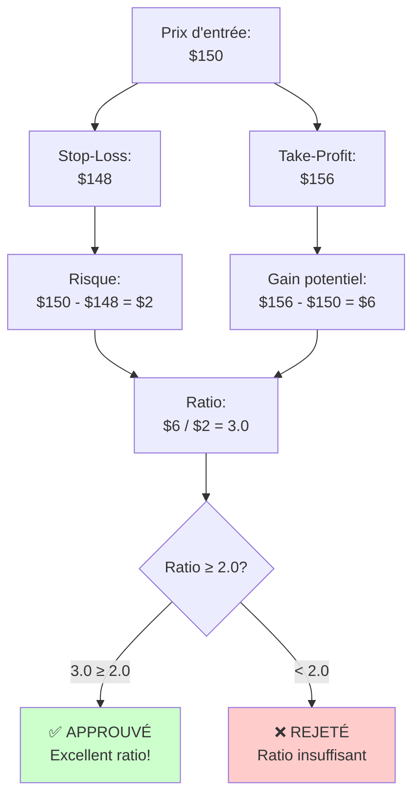
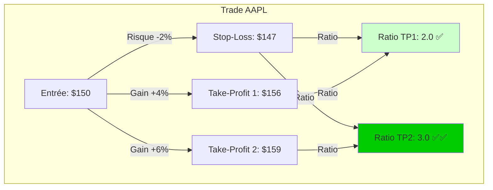
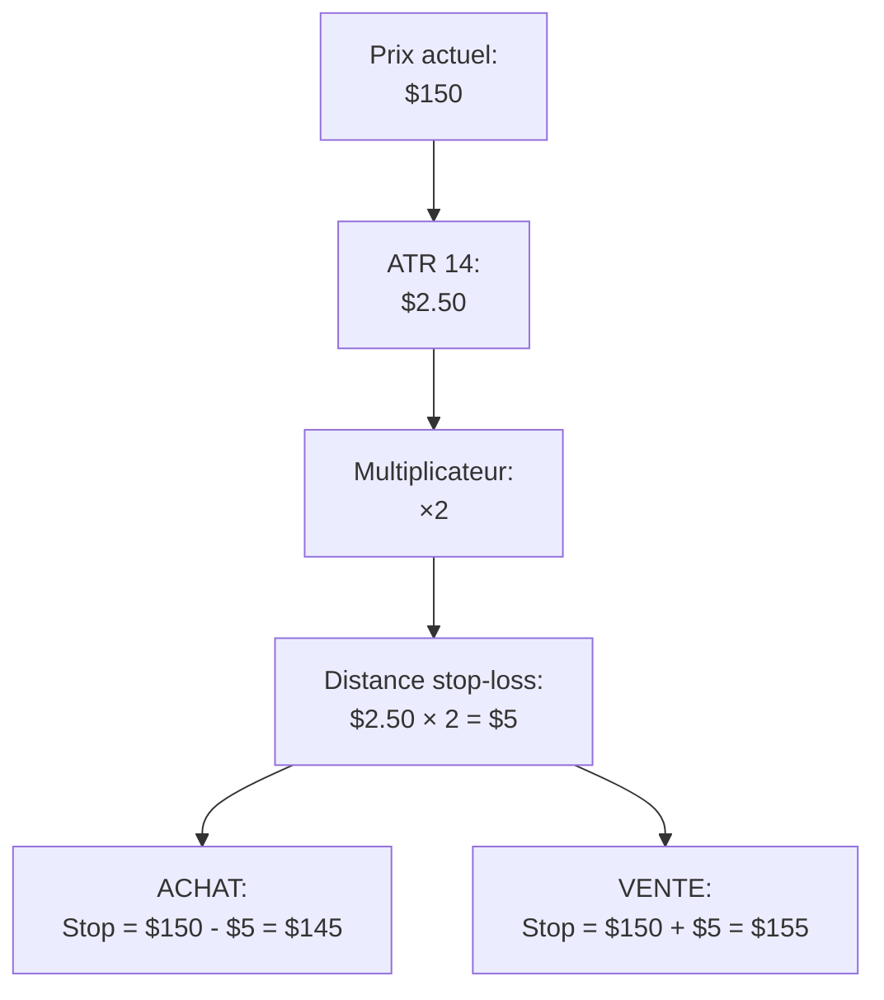
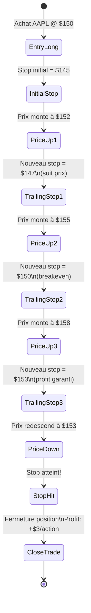
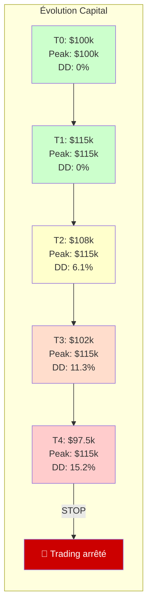
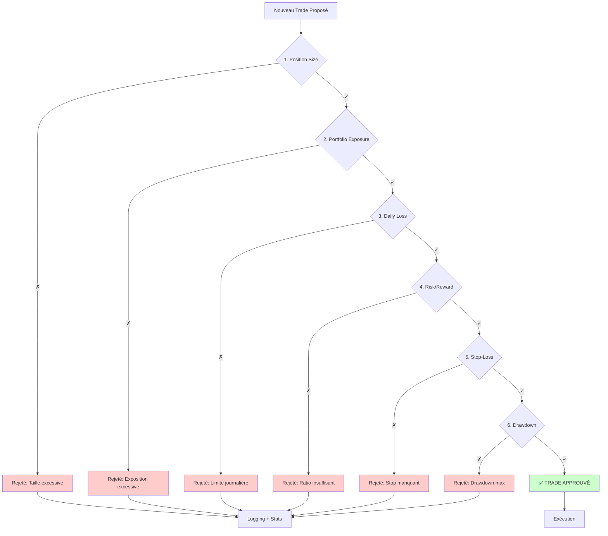

# Gestion des Risques - Guide Détaillé

[← Retour Architecture](./ARCHITECTURE.md)

## Vue d'ensemble

La gestion des risques est **le pilier central** du système Quantum Trader. Chaque trade passe par **5 validations** obligatoires avant exécution.



---

## 1. Limite de Taille de Position 📏

**Objectif** : Éviter une exposition excessive sur un seul titre.

### Règle

```yaml
risk_management:
  position_limits:
    max_position_size: 100  # Maximum 100 actions par position
```

### Validation

```mermaid
graph LR
    Proposed[Quantité proposée] --> Check{Quantité ≤ Max?}

    Check -->|Oui| Valid[✓ Valide]
    Check -->|Non| Invalid[✗ Invalide]

    Invalid --> Reject[REJETÉ:\n"Position size too large"]

    style Valid fill:#ccffcc
    style Invalid fill:#ffcccc
```

### Exemple

| Symbole | Quantité demandée | Max autorisé | Résultat |
|---------|-------------------|--------------|----------|
| AAPL | 50 | 100 | ✅ Approuvé |
| MSFT | 120 | 100 | ❌ Rejeté : "Taille max = 100" |
| GOOGL | 100 | 100 | ✅ Approuvé (limite exacte) |

### Calcul Dynamique (Optionnel)

Le système peut calculer la taille optimale basée sur le capital :

```python
# Méthode: risk_based
capital_total = 100_000  # $100k
risk_per_trade = 0.01    # 1% du capital
prix_action = 150        # AAPL @ $150
stop_loss_distance = 5   # $5 de risque par action

quantite_max = (capital_total * risk_per_trade) / stop_loss_distance
# = (100_000 * 0.01) / 5 = 200 actions

# Mais limité par max_position_size
quantite_finale = min(quantite_max, max_position_size)
# = min(200, 100) = 100 actions
```

---

## 2. Limite d'Exposition du Portfolio 💼

**Objectif** : Éviter la sur-concentration du capital sur un nombre limité de titres.

### Règle

```yaml
risk_management:
  position_limits:
    max_portfolio_exposure: 0.25  # Maximum 25% du portfolio
```

### Validation



### Exemple Détaillé

**Situation actuelle** :
| Position | Quantité | Prix | Valeur | % Portfolio |
|----------|----------|------|--------|-------------|
| MSFT | 100 | $300 | $30,000 | 15% |
| GOOGL | 50 | $140 | $7,000 | 3.5% |
| Cash | - | - | $63,000 | 31.5% |
| **Total** | - | - | **$100,000** | **50%** |

**Exposition totale actuelle** : $37,000 (18.5%)

**Nouveau trade proposé** : AAPL × 100 @ $150 = $15,000

**Nouvelle exposition** : $37,000 + $15,000 = $52,000 (26%)

**Résultat** : ❌ **REJETÉ** (26% > 25%)

**Solution** : Réduire à AAPL × 46 @ $150 = $6,900
- Nouvelle exposition : $43,900 (21.95%) ✅

### Formule

```python
def check_portfolio_exposure(portfolio_value, current_positions, new_trade):
    # Valeur totale des positions actuelles
    current_exposure = sum(pos.quantity * pos.price for pos in current_positions)

    # Valeur du nouveau trade
    new_trade_value = new_trade.quantity * new_trade.price

    # Exposition totale après trade
    total_exposure = current_exposure + new_trade_value

    # Ratio d'exposition
    exposure_ratio = total_exposure / portfolio_value

    # Validation
    max_exposure = 0.25  # 25%
    return exposure_ratio <= max_exposure
```

---

## 3. Limite de Perte Journalière 📉

**Objectif** : Limiter les dégâts lors d'une mauvaise journée de trading.

### Règle

```yaml
risk_management:
  loss_limits:
    daily_loss_limit: 1000  # Maximum $1,000 de perte par jour
```

### Suivi en Temps Réel



### Exemple

**Historique de la journée** :
| Heure | Trade | Résultat | P&L Cumulé |
|-------|-------|----------|------------|
| 09:30 | AAPL ACHAT | +$150 | +$150 |
| 10:15 | MSFT VENTE | -$200 | -$50 |
| 11:00 | GOOGL ACHAT | +$300 | +$250 |
| 13:30 | TSLA ACHAT | -$600 | -$350 |
| 14:45 | NVDA VENTE | -$400 | -$750 |
| **15:20** | **AAPL VENTE** | **-$300** | **-$1,050** ❌ |

**À 15:20** : P&L = -$1,050
- Dépasse limite de -$1,000
- **Système bloque tous les nouveaux trades**
- Notification envoyée à l'utilisateur
- Reprise le lendemain

### Protection Proactive

Le système peut **refuser un trade** si la perte potentielle dépasserait la limite :

```python
current_loss = -750  # Déjà -$750 aujourd'hui
max_daily_loss = -1000
remaining_risk = max_daily_loss - current_loss  # -$250

proposed_trade_risk = -300  # Trade risque -$300

if abs(proposed_trade_risk) > abs(remaining_risk):
    return "REJECTED: Would exceed daily loss limit"
```

---

## 4. Ratio Risk/Reward 🎯

**Objectif** : S'assurer que chaque trade a un potentiel de gain supérieur au risque encouru.

### Règle

```yaml
risk_management:
  risk_reward:
    min_ratio: 2.0    # Minimum 2:1 (gagner 2× ce qui est risqué)
    target_ratio: 3.0 # Idéal 3:1
```

### Calcul



### Exemple

| Titre | Prix Entrée | Stop-Loss | Take-Profit | Risque | Gain | Ratio | Résultat |
|-------|-------------|-----------|-------------|--------|------|-------|----------|
| AAPL | $150 | $148 | $156 | $2 | $6 | **3.0** | ✅ Excellent |
| MSFT | $300 | $295 | $308 | $5 | $8 | **1.6** | ❌ Rejeté (< 2.0) |
| GOOGL | $140 | $137 | $146 | $3 | $6 | **2.0** | ✅ Acceptable |
| TSLA | $200 | $198 | $206 | $2 | $6 | **3.0** | ✅ Excellent |

### Formule

```python
def calculate_risk_reward(entry_price, stop_loss, take_profit):
    risk = abs(entry_price - stop_loss)
    reward = abs(take_profit - entry_price)

    if risk == 0:
        return None  # Éviter division par zéro

    ratio = reward / risk

    return {
        'ratio': ratio,
        'approved': ratio >= 2.0,
        'risk_amount': risk,
        'reward_amount': reward
    }
```

### Placement Optimal



---

## 5. Stop-Loss Dynamique 🛑

**Objectif** : Limiter les pertes sur chaque position individuelle.

### Calcul avec ATR

Le stop-loss est calculé dynamiquement en utilisant l'**ATR (Average True Range)** :



### Configuration

```yaml
risk_management:
  stop_loss:
    atr_multiplier: 2  # 2× l'ATR
    max_loss_per_trade: 0.02  # Max 2% du capital par trade
```

### Exemple ACHAT

**Données** :
- Prix actuel AAPL : **$150**
- ATR(14) : **$2.50**
- Multiplicateur : **2**

**Calcul** :
```
Distance = ATR × Multiplicateur = $2.50 × 2 = $5
Stop-Loss = Prix - Distance = $150 - $5 = $145
Risque par action = $5
```

**Validation avec capital** :
```
Capital total : $100,000
Max perte par trade : 2% = $2,000
Quantité max = $2,000 / $5 = 400 actions

Mais limité par max_position_size = 100 actions
Quantité finale = 100 actions
Risque total = 100 × $5 = $500 ✅
```

### Stop-Loss Trailing

Une fois le trade en profit, le stop-loss **suit** le prix :



### Code d'implémentation

```python
def calculate_dynamic_stop_loss(current_price, atr_value, multiplier=2, position_type='long'):
    """
    Calcule le stop-loss dynamique basé sur l'ATR

    Args:
        current_price: Prix actuel du titre
        atr_value: Valeur de l'ATR(14)
        multiplier: Multiplicateur ATR (default: 2)
        position_type: 'long' ou 'short'

    Returns:
        Prix du stop-loss
    """
    distance = atr_value * multiplier

    if position_type == 'long':
        stop_loss = current_price - distance
    else:  # short
        stop_loss = current_price + distance

    return round(stop_loss, 2)
```

---

## 6. Drawdown Maximum 📊

**Objectif** : Limiter la baisse maximale du capital depuis le pic historique.

### Règle

```yaml
risk_management:
  loss_limits:
    max_drawdown: 0.15  # Maximum 15% de baisse depuis le pic
```

### Calcul

```mermaid
graph TB
    Peak[Pic historique:\n$120,000] --> Current[Capital actuel:\n$105,000]

    Current --> Calc[Drawdown:\n($120k - $105k) / $120k]

    Calc --> Result[= $15k / $120k\n= 12.5%]

    Result --> Check{12.5% ≤ 15%?}

    Check -->|Oui| Safe[✅ Dans les limites\nTrading continue]
    Check -->|Non| Danger[❌ Limite dépassée\nArrêt trading]

    style Safe fill:#ccffcc
    style Danger fill:#ffcccc
```

### Exemple Détaillé

**Historique du capital** :

| Date | Capital | Pic précédent | Drawdown | Action |
|------|---------|---------------|----------|--------|
| 01/01 | $100,000 | $100,000 | 0% | ✅ Trading |
| 15/01 | $115,000 | $115,000 | 0% | ✅ Trading |
| 01/02 | $108,000 | $115,000 | 6.1% | ✅ Trading |
| 15/02 | $102,000 | $115,000 | 11.3% | ✅ Trading |
| 01/03 | $97,500 | $115,000 | **15.2%** | ❌ **STOP** |

**Le 01/03** :
- Drawdown = ($115,000 - $97,500) / $115,000 = 15.2%
- Dépasse la limite de 15%
- **Tous les trades sont bloqués**
- Notification d'urgence envoyée
- Nécessite intervention manuelle pour reprendre

### Graphique de Suivi



---

## Hiérarchie des Validations



---

## Configuration Complète

```yaml
risk_management:
  # Limites de position
  position_limits:
    max_position_size: 100
    max_portfolio_exposure: 0.25

  # Limites de perte
  loss_limits:
    daily_loss_limit: 1000
    max_drawdown: 0.15

  # Fréquence de trading
  trade_frequency:
    min_time_between_trades: 300  # 5 minutes
    max_daily_trades: 10

  # Stop-loss
  stop_loss:
    atr_multiplier: 2
    max_loss_per_trade: 0.02

  # Risk/Reward
  risk_reward:
    min_ratio: 2.0
    target_ratio: 3.0
```

---

## Fichiers d'Implémentation

| Fichier | Responsabilité |
|---------|----------------|
| `src/trading/agents/risk_validator.py` | Validation principale |
| `src/config/config.yaml` | Paramètres de risque |
| `docs/risk_management.md` | Documentation originale |

---

**Navigation**
- [← Architecture](./ARCHITECTURE.md)
- [← Système Multi-Agents](./AGENTS_SYSTEM.md)
- [← Indicateurs Techniques](./INDICATORS.md)
- [→ Flux de Travail](./WORKFLOW.md)
