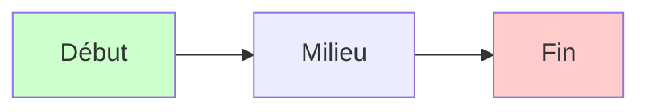
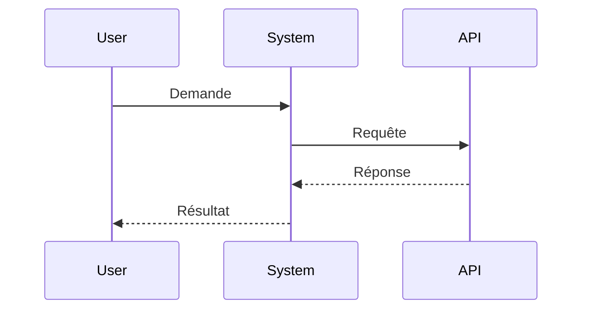
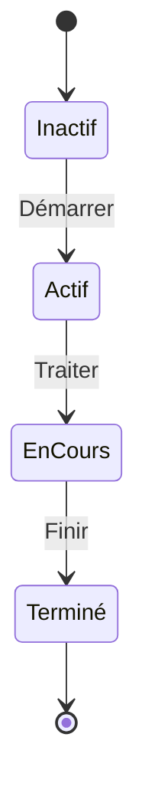
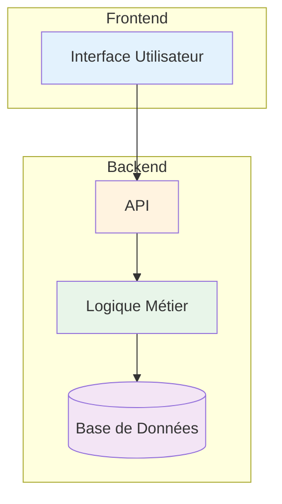

# Test Mermaid Preview

Ouvrez ce fichier dans VS Code et appuyez sur **Ctrl+Shift+V** (ou **Cmd+Shift+V** sur Mac) pour voir la prévisualisation.

## Test 1 : Graphe Simple

## Test 2 : Diagramme de Séquence

## Test 3 : Diagramme d'États

## Test 4 : Graphe Complexe (Architecture)

## Comment utiliser

1. **Ouvrir la prévisualisation** : `Ctrl+Shift+V` (Windows/Linux) ou `Cmd+Shift+V` (Mac)
2. **Prévisualisation côte à côte** : `Ctrl+K V` puis ouvrir le fichier

Si vous voyez les diagrammes rendus (pas le code), ça fonctionne ! ✅

Si vous voyez juste le code Mermaid, l'extension n'est pas active. Redémarrez VS Code.
