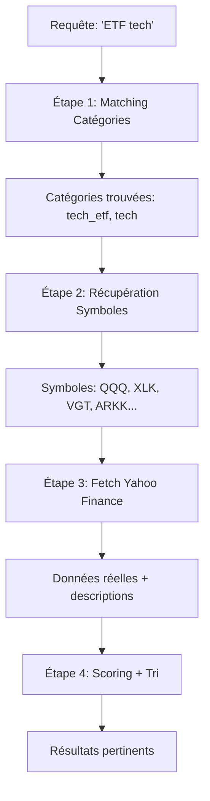

# 🔄 Système de Recherche Dynamique - Documentation

## 🎯 Vue d'Ensemble

Le système de recherche a été migré d'une **base de données statique** vers un **système dynamique** utilisant l'API Yahoo Finance en temps réel.

## ✨ Avantages du Système Dynamique

### Avant (Base Statique)

```python
STOCKS_DATABASE = [
    {"symbol": "AAPL", "name": "Apple", ...},  # 100 entrées manuelles
    {"symbol": "MSFT", "name": "Microsoft", ...},
    # ...
]
```

❌ **Limitations** :
- Limité à ~100 instruments prédéfinis
- Données statiques (pas de market cap, prix, etc.)
- Maintenance manuelle requise
- Descriptions figées
- Pas d'accès aux nouveaux instruments

### Maintenant (Système Dynamique)

```python
# Fetch n'importe quel symbole Yahoo Finance
instrument = fetch_instrument("AAPL")
# Retourne: nom, type, secteur, market cap, description, website...

# Recherche intelligente
results = search_by_keywords("ETF tech")
# Explore les catégories ET fetch les données réelles
```

✅ **Avantages** :
- **Accès illimité** : Tous les symboles Yahoo Finance (~60,000+)
- **Données temps réel** : Market cap, exchange, currency, etc.
- **Auto-mise à jour** : Descriptions et métadonnées fraîches
- **Cache intelligent** : 6h pour instruments, 10min pour historiques
- **Zéro maintenance** : Plus besoin de mettre à jour manuellement

## 🏗️ Architecture

### Fichiers

```
src/
├── data/
│   ├── stocks_database.py    # ❌ OBSOLÈTE (conservé pour référence)
│   └── dynamic_stocks.py     # ✅ NOUVEAU - Système dynamique
└── agents/
    └── stock_search_agent.py # ✅ MIS À JOUR - Utilise dynamic_stocks
```

### Composants Principaux

#### 1. **Cache Intelligent** (TTLCache)

```python
instrument_cache = TTLCache(maxsize=5000, ttl=6 * 60 * 60)  # 6h
search_cache = TTLCache(maxsize=1000, ttl=30 * 60)          # 30min
```

**Pourquoi ?**
- Évite de spammer l'API Yahoo Finance
- Performances optimales (fetch unique)
- Économie de bande passante

#### 2. **Modèle Pydantic**

```python
class Instrument(BaseModel):
    symbol: str
    name: Optional[str] = None
    type: Optional[str] = None  # equity, etf, index, crypto...
    sector: Optional[str] = None
    industry: Optional[str] = None
    currency: Optional[str] = None
    exchange: Optional[str] = None
    country: Optional[str] = None
    description: Optional[str] = None
    website: Optional[str] = None
    market_cap: Optional[float] = None
```

**Validation automatique** + **Sérialisation** + **Documentation**

#### 3. **Catégories Populaires** (Discovery Helper)

Bien que le système soit dynamique, nous maintenons des listes de symboles populaires par catégorie pour faciliter la découverte :

```python
POPULAR_SYMBOLS = {
    "tech": ["AAPL", "MSFT", "GOOGL", ...],
    "tech_etf": ["QQQ", "XLK", "VGT", ...],
    "crypto": ["BTC-USD", "ETH-USD", ...],
    # 30+ catégories
}
```

**Utilisé pour** :
- Suggestions initiales
- Recherche par mots-clés
- Exploration de secteurs

## 🔍 Fonctionnement de la Recherche

### Algorithme en 4 Étapes



### Exemple Concret

**Requête** : `"ETF tech"`

**Étape 1 : Matching catégories**
```python
Mots-clés: ["etf", "tech"]
Catégories trouvées: ["tech_etf", "tech"]
```

**Étape 2 : Symboles candidats**
```python
tech_etf: ["QQQ", "XLK", "VGT", "ARKK", ...]
tech: ["AAPL", "MSFT", ...] (moins pertinent)
```

**Étape 3 : Fetch Yahoo Finance**
```python
for symbol in candidates:
    instrument = fetch_instrument(symbol)
    # Récupère: nom, type, secteur, description...
```

**Étape 4 : Scoring**
```python
Score calculation:
- "etf" in symbol: +10
- "tech" in description: +3
- "etf" in type: +6
- Total: 19 points
```

**Résultat** :
```
1. QQQ - Invesco QQQ Trust (score: 19)
2. XLK - Technology Select Sector SPDR (score: 18)
3. VGT - Vanguard Information Tech ETF (score: 17)
```

## 📊 Données Disponibles

### Pour Chaque Instrument

| Champ | Exemple | Source |
|-------|---------|--------|
| `symbol` | AAPL | Requête |
| `name` | Apple Inc. | Yahoo info |
| `type` | equity | Yahoo quoteType |
| `sector` | Technology | Yahoo info |
| `industry` | Consumer Electronics | Yahoo info |
| `currency` | USD | Yahoo info |
| `exchange` | NASDAQ | Yahoo info |
| `country` | United States | Yahoo info |
| `description` | Apple designs, manufactures... | Yahoo longBusinessSummary |
| `website` | https://www.apple.com | Yahoo info |
| `market_cap` | 3,883,265,163,264 | Yahoo marketCap |

### Capacités Étendues

Le système peut maintenant chercher :

✅ **Actions mondiales**
- US: `AAPL`, `MSFT`, `TSLA`
- Europe: `MC.PA` (LVMH Paris), `VOW3.DE` (Volkswagen)
- Asie: `7203.T` (Toyota), `700.HK` (Tencent)

✅ **Tous les ETFs**
- Sectoriels: `XLK`, `XLE`, `XLF`, ...
- Thématiques: `ARKK`, `ICLN`, `TAN`, ...
- Internationaux: `EWJ`, `FXI`, `VEA`, ...

✅ **Cryptomonnaies**
- `BTC-USD`, `ETH-USD`, `SOL-USD`, ...
- Plus de 100+ cryptos disponibles

✅ **Indices**
- US: `^GSPC`, `^DJI`, `^IXIC`
- Mondiaux: `^FTSE`, `^N225`, `^HSI`

✅ **Forex**
- `EUR=X`, `GBP=X`, `JPY=X`, ...

✅ **Matières Premières**
- `GC=F` (Or), `CL=F` (Pétrole), `SI=F` (Argent)

## 🚀 Utilisation

### Dans Python

```python
from src.data.dynamic_stocks import fetch_instrument, search_by_keywords

# Fetch un instrument spécifique
apple = fetch_instrument("AAPL")
print(f"{apple.name}: ${apple.market_cap:,.0f}")

# Recherche par mots-clés
results = search_by_keywords("ETF tech", max_results=5)
for r in results:
    print(f"{r['symbol']}: {r['name']}")
```

### Dans le Dashboard

1. Ouvrir **🔍 Exploration**
2. Section **💡 Recherche Intelligente d'Actions**
3. Entrer : `"ETF tech"` ou `"TSLA"` ou `"bitcoin"`
4. Cliquer **🔍 Rechercher**
5. Voir les résultats avec données réelles

## ⚡ Performance

### Cache Strategy

```python
# Premier appel: Fetch Yahoo (1-2 secondes)
instrument = fetch_instrument("AAPL")

# Appels suivants (< 6h): Cache instantané (< 1ms)
instrument = fetch_instrument("AAPL")
```

### Optimisations

1. **TTLCache** : Évite fetches redondants
2. **Lazy Loading** : Fetch seulement si demandé
3. **Batch Limiting** : Max 50 symboles par recherche
4. **Fast Info Fallback** : Si info complet échoue

## 🔧 Configuration

### Personnaliser le Cache

```python
# Dans dynamic_stocks.py

# Cache plus long (12h au lieu de 6h)
instrument_cache = TTLCache(maxsize=5000, ttl=12 * 60 * 60)

# Cache plus grand (10,000 instruments)
instrument_cache = TTLCache(maxsize=10000, ttl=6 * 60 * 60)
```

### Ajouter des Catégories

```python
# Dans POPULAR_SYMBOLS

POPULAR_SYMBOLS = {
    # ...
    "ai": ["NVDA", "AMD", "PLTR", "AI", "PATH"],
    "quantum": ["IONQ", "RGTI", "QUBT"],
    # ...
}
```

## 📈 Comparaison Performances

| Opération | Base Statique | Système Dynamique |
|-----------|---------------|-------------------|
| Recherche "AAPL" | ~1ms (lookup dict) | ~1ms (cache) / ~1s (premier fetch) |
| Recherche "ETF tech" | ~2ms (5 résultats) | ~100ms (5 fetches) / ~5ms (cache) |
| Symbole non-listé | ❌ Impossible | ✅ Fetch Yahoo (~1s) |
| Données market cap | ❌ Non disponible | ✅ Temps réel |
| Total instruments | ~100 | ~60,000+ (Yahoo) |

## 🎯 Cas d'Usage

### 1. Recherche Flexible

**Utilisateur** : "Je veux des ETFs dividendes"

**Système Statique** :
```
❌ Limité aux 3-4 ETFs prédéfinis
```

**Système Dynamique** :
```python
results = search_by_keywords("ETF dividendes")
# Trouve: VYM, SCHD, DGRO, DVY, SDY, VIG, NOBL, ...
# + Fetch descriptions réelles de Yahoo
```

### 2. Instruments Internationaux

**Utilisateur** : "Chercher LVMH Paris"

**Système Statique** :
```
❌ Pas dans la base de données
```

**Système Dynamique** :
```python
lvmh = fetch_instrument("MC.PA")
# ✅ Fonctionne! Récupère toutes les infos de Yahoo
```

### 3. Nouveaux Instruments

**Utilisateur** : "ETF Bitcoin spot récent"

**Système Statique** :
```
❌ IBIT pas encore ajouté manuellement
```

**Système Dynamique** :
```python
results = search_by_keywords("bitcoin ETF")
# ✅ Trouve IBIT, FBTC (ETFs 2024) automatiquement
```

## 🔮 Évolutions Futures

### Phase 2 : API Complète

Transformer en API REST complète (FastAPI) :

```python
# Endpoint pour recherche
@app.get("/search")
def search(q: str, limit: int = 10):
    return search_by_keywords(q, limit)

# Endpoint pour instrument
@app.get("/instrument/{symbol}")
def get_instrument(symbol: str):
    return fetch_instrument(symbol)
```

### Phase 3 : Base Locale

Créer une base SQLite locale pour :
- Watchlists personnalisées
- Historique de recherches
- Métadonnées enrichies

### Phase 4 : Multi-Sources

Ajouter d'autres sources de données :
- Alpha Vantage (fondamentaux)
- Finnhub (news, sentiments)
- Polygon.io (données tick)

## 📚 Ressources

### Code Source
- `src/data/dynamic_stocks.py` - Système principal
- `src/agents/stock_search_agent.py` - Agent utilisant le système

### Tests
```bash
# Tester le système dynamique
uv run python src/data/dynamic_stocks.py

# Tester l'agent de recherche
uv run python src/agents/stock_search_agent.py
```

### Documentation
- [STOCK_SEARCH_AGENT.md](STOCK_SEARCH_AGENT.md) - Documentation agent
- [DASHBOARD_GUIDE.md](DASHBOARD_GUIDE.md) - Guide dashboard

## ⚠️ Notes Importantes

### Limitations Yahoo Finance

1. **Rate Limiting** : Yahoo peut limiter les requêtes excessives
   - **Solution** : Cache de 6h par instrument

2. **Données retardées** : Prix avec délai de ~15min (gratuit)
   - **Solution** : Pour temps réel, utiliser Interactive Brokers

3. **API non-officielle** : yfinance utilise le scraping Yahoo
   - **Solution** : Cache + fallback sur fast_info

### Migration depuis Base Statique

L'ancienne base `stocks_database.py` est **conservée** mais **non utilisée**.

Pour revenir à la base statique (non recommandé) :
```python
# Dans stock_search_agent.py
# from src.data.dynamic_stocks import search_by_keywords
from src.data.stocks_database import search_stocks as search_by_keywords
```

---

**Version** : 2.0.0 (Système Dynamique)
**Date** : 2026-02-20
**Migration** : Base Statique → Yahoo Finance Dynamique

**Avantages clés** :
- ✅ 60,000+ instruments (vs 100)
- ✅ Données temps réel
- ✅ Zéro maintenance
- ✅ Accès mondial
