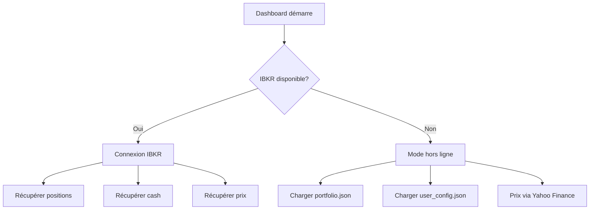

# 📡 Intégration IBKR en Temps Réel

## 🎯 Fonctionnalités

Le dashboard récupère maintenant **automatiquement** vos données réelles depuis Interactive Brokers:

### ✅ Données IBKR Récupérées

1. **Positions du Portfolio** 📊
   - Symboles détenus
   - Quantité d'actions
   - Prix moyen d'achat
   - Valeur actuelle

2. **Prix en Temps Réel** 💹
   - Prix actuels des actions
   - Données de marché (delayed ou real-time selon abonnement)

3. **Cash Disponible** 💰
   - Solde cash du compte
   - Capital disponible pour investir

4. **Résumé du Compte** 📈
   - Valeur nette de liquidation
   - Pouvoir d'achat
   - Fonds disponibles

---

## 🚀 Prérequis

### 1. TWS ou IB Gateway

Vous devez avoir **TWS (Trader Workstation)** ou **IB Gateway** en cours d'exécution.

**Téléchargement:**
- [TWS](https://www.interactivebrokers.com/en/trading/tws.php)
- [IB Gateway](https://www.interactivebrokers.com/en/trading/ibgateway-stable.php) (version légère)

### 2. Activer l'API

Dans TWS/IB Gateway:
1. **File → Global Configuration → API → Settings**
2. Cocher **"Enable ActiveX and Socket Clients"**
3. Cocher **"Read-Only API"** (pour plus de sécurité)
4. Noter le port (par défaut: **7497** pour TWS, **4002** pour IB Gateway)
5. Ajouter **127.0.0.1** dans "Trusted IP Addresses" si nécessaire

### 3. Configuration

Vérifier `src/config/config.yaml`:

```yaml
api:
  tws_endpoint: "127.0.0.1"
  port: 7497  # 7497 pour TWS, 4002 pour IB Gateway
```

---

## 📊 Modes de Fonctionnement

### Mode 1: IBKR Connecté (Temps Réel) ✅

**Quand TWS/Gateway est lancé et connecté:**

```
✅ Connecté à IBKR - Données en temps réel
📡 Positions chargées depuis votre compte IBKR en temps réel
```

**Sources des données:**
- ✅ **Positions:** IBKR API (reqPositions)
- ✅ **Prix:** IBKR API (reqMktData)
- ✅ **Cash:** IBKR API (reqAccountSummary)

**Avantages:**
- 📡 Données en temps réel
- 🔄 Synchronisation automatique
- ✅ Toujours à jour

### Mode 2: Hors Ligne (Fallback) 📁

**Quand TWS/Gateway n'est pas disponible:**

```
⚠️ Mode hors ligne - Données depuis configuration locale
💾 Positions chargées depuis la configuration locale (portfolio.json)
```

**Sources des données:**
- 📁 **Positions:** `dashboard/portfolio.json`
- 🌐 **Prix:** Yahoo Finance (yfinance)
- ⚙️ **Cash:** `dashboard/user_config.json`

**Avantages:**
- 📴 Fonctionne sans connexion IBKR
- 💾 Données persistées localement
- 🔄 Peut être mis à jour manuellement

---

## 🧪 Test de Connexion

### Test Rapide

```bash
cd dashboard
uv run python test_ibkr_portfolio.py
```

**Résultat attendu (IBKR connecté):**

```
=== Test Connexion IBKR ===

Tentative de connexion à 127.0.0.1:7497...
✅ Connexion IBKR réussie!

=== Récupération des Positions ===

✅ 3 position(s) trouvée(s):

  AAPL:
    - Quantité: 10.0
    - Prix moyen: $150.00
    - Type: STK

  MSFT:
    - Quantité: 5.0
    - Prix moyen: $350.00
    - Type: STK

=== Récupération du Cash ===

✅ Résumé du compte:
  NetLiquidation: $12,345.67
  TotalCashValue: $8,500.00
  GrossPositionValue: $3,845.67

=== Test PortfolioManager avec IBKR ===

Résumé du portfolio:
  Positions: 2
  Capital investi: $2,250.00
  Valeur actuelle: $2,500.00
  Plus-value: $250.00
  Cash disponible: $8,500.00

✅ Déconnexion réussie
```

---

## 🔄 Flux de Données

### Au Démarrage du Dashboard



### Récupération des Positions

**Avec IBKR:**
```python
# Automatique via API
positions = client.get_account_positions()

# Conversion automatique au format standard
{
    'symbol': 'AAPL',
    'shares': 10,
    'avg_price': 150.00,
    'from_ibkr': True  # Marqueur
}
```

**Sans IBKR:**
```python
# Depuis portfolio.json
{
    'symbol': 'AAPL',
    'shares': 10,
    'avg_price': 150.00,
    'date_bought': '2024-01-15',
    'ibkr_plan': 'Lite'
}
```

---

## 📝 Exemple d'Utilisation

### Scénario: Portfolio Réel IBKR

**Situation:**
- Vous avez 3 positions dans IBKR
- AAPL: 10 actions @ $150
- MSFT: 5 actions @ $350
- Cash: $8,500

**Dans le Dashboard:**

1. Lancer TWS/Gateway
2. Lancer le dashboard: `run_dashboard.bat`
3. Aller dans **📊 Portfolio**

**Affichage:**
```
✅ Connecté à IBKR - Données en temps réel

📈 Résumé Global
🏦 Capital Disponible: $8,500.00
💰 Capital Investi: $3,250.00
📊 Valeur Positions: $3,500.00 (si prix actuel)
💎 Capitalisation Totale: $12,000.00
```

**Tableau:**
```
Symbole | Actions | Prix Achat | Prix Actuel | Gain IBKR | Gain Réel
AAPL    | 10      | $150.00    | $165.00     | +10.00%   | +9.96%
MSFT    | 5       | $350.00    | $360.00     | +2.86%    | +2.82%
```

---

## 🛠️ Dépannage

### Problème: "Mode hors ligne"

**Solutions:**

1. **Vérifier que TWS/Gateway est lancé**
   ```bash
   # Vérifier le processus
   tasklist | findstr tws  # Windows
   ps aux | grep tws       # Linux/Mac
   ```

2. **Vérifier le port**
   - TWS: 7497
   - IB Gateway: 4002
   - Modifier dans `src/config/config.yaml` si différent

3. **Vérifier l'API est activée**
   - TWS → File → Global Configuration → API → Settings
   - Cocher "Enable ActiveX and Socket Clients"

4. **Vérifier le firewall**
   - Autoriser Python à accéder au réseau local
   - Autoriser TWS/Gateway

### Problème: "No security definition found"

**Cause:** Le symbole n'est pas reconnu par IBKR

**Solutions:**
- Vérifier l'orthographe du symbole
- Utiliser le symbole IBKR (ex: "BRK B" pour Berkshire Hathaway)
- Vérifier que l'instrument est tradable

### Problème: "Market data not subscribed"

**Cause:** Pas d'abonnement aux données de marché

**Solution:**
- Le dashboard utilise automatiquement les données **delayed** (gratuites)
- Aucun abonnement nécessaire
- Délai de 15 minutes sur les prix

---

## 📊 Comparaison des Modes

| Fonctionnalité | IBKR Connecté | Hors Ligne |
|----------------|---------------|------------|
| **Positions** | ✅ Temps réel | 📁 JSON manuel |
| **Prix** | ✅ IBKR delayed/RT | 🌐 Yahoo Finance |
| **Cash** | ✅ Compte réel | ⚙️ Config locale |
| **Synchronisation** | 🔄 Automatique | ✋ Manuel |
| **Latence** | ⚡ Instantané | 🐌 Cache 5min |
| **Précision** | 💯 100% | ⚠️ Peut différer |

---

## 🔐 Sécurité

### Recommandations

1. **Utiliser "Read-Only API"** dans TWS
   - Empêche les modifications du compte
   - Autorise uniquement la lecture

2. **Localhost uniquement**
   - Connexion sur 127.0.0.1
   - Pas d'exposition réseau

3. **Pas de credentials dans le code**
   - Pas de mot de passe stocké
   - Authentification via TWS

4. **Fermer TWS quand inutilisé**
   - Dashboard fonctionne en mode hors ligne
   - Connexion uniquement quand nécessaire

---

## 🎯 Recommandations d'Usage

### Pour le Trading Actif
- ✅ Garder TWS/Gateway ouvert
- ✅ Utiliser IBKR en temps réel
- ✅ Synchronisation automatique

### Pour le Suivi Occasionnel
- 📁 Mode hors ligne suffisant
- 🌐 Yahoo Finance pour les prix
- 🔄 Mise à jour manuelle du JSON

### Pour le Backtesting
- 📁 Mode hors ligne
- 📊 Historique depuis JSON
- 🔄 Pas besoin de connexion IBKR

---

## 📚 Ressources

- [IBKR API Documentation](https://interactivebrokers.github.io/tws-api/)
- [TWS Configuration](https://www.interactivebrokers.com/en/trading/tws.php)
- [Python ibapi Library](https://pypi.org/project/ibapi/)

---

**Version:** 1.0.0
**Date:** 2026-02-20
**Status:** ✅ Production Ready
