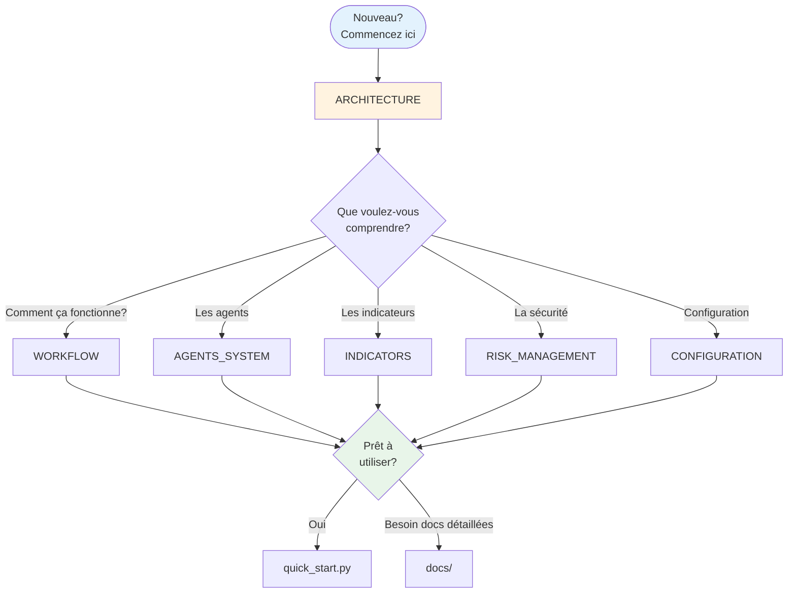
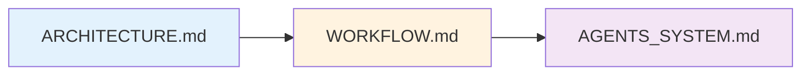
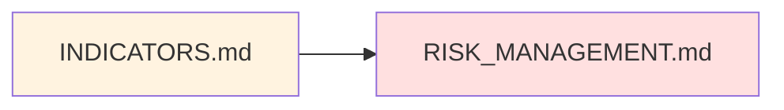
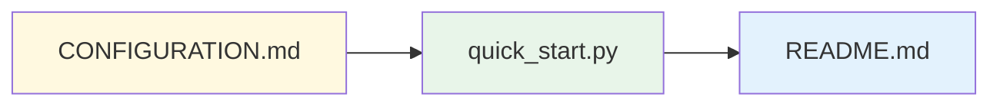
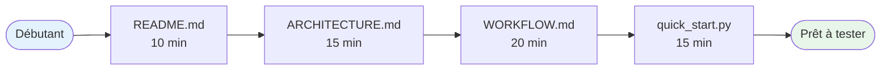
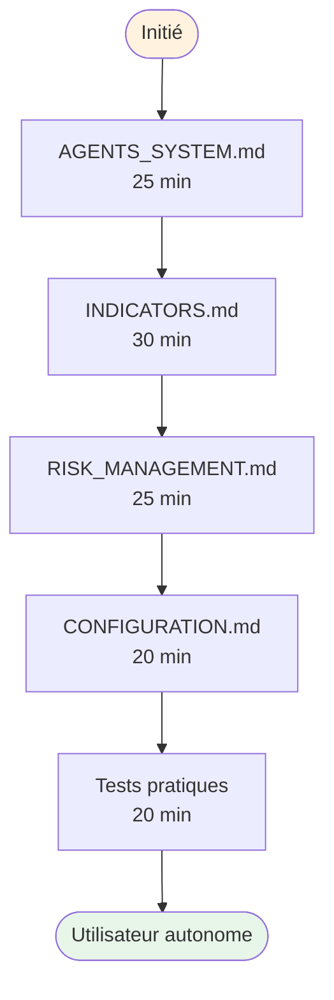
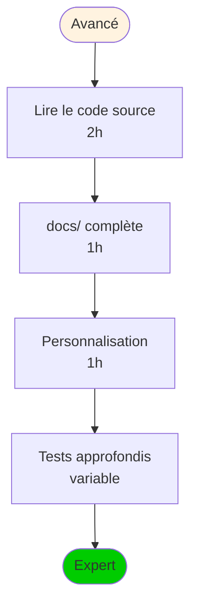

# Documentation Quantum Trader - Index

Bienvenue dans la documentation complète du système Quantum Trader ! Cette documentation vous guide de la compréhension générale aux détails techniques.



---

## 🚀 Démarrage Rapide

Pour les nouveaux utilisateurs :

1. **[ARCHITECTURE.md](./ARCHITECTURE.md)** ⭐ **Commencez ici**
   - Vue d'ensemble du système
   - Schémas de l'architecture
   - Composants principaux
   - Flux de données

2. **[WORKFLOW.md](./WORKFLOW.md)** - Comprendre le fonctionnement
   - Cycle de vie complet d'un trade
   - Étapes de l'initialisation à l'exécution
   - Exemples concrets

3. **[quick_start.py](./quick_start.py)** - Tester le système
   - Script de démarrage rapide
   - Vérifie la configuration
   - Guide les prochaines étapes

4. **[dashboard_app.py](./dashboard_app.py)** ⭐ **NOUVEAU - Dashboard Interactif**
   - Interface web Streamlit
   - Analyse d'actions avec IA
   - Graphiques interactifs
   - Multi-périodes (1j à 10ans)
   - 📖 [Guide du Dashboard](./DASHBOARD_GUIDE.md)

---

## 📚 Documentation Principale

### Vue d'Ensemble

| Document | Description | Niveau | Temps lecture |
|----------|-------------|--------|---------------|
| **[ARCHITECTURE.md](./ARCHITECTURE.md)** | Architecture complète du système | Débutant | 15 min |
| **[WORKFLOW.md](./WORKFLOW.md)** | Flux de travail détaillé | Intermédiaire | 20 min |
| **[README.md](./README.md)** | Guide d'installation et usage | Débutant | 10 min |

### Composants Techniques

| Document | Sujet | Niveau | Temps lecture |
|----------|-------|--------|---------------|
| **[AGENTS_SYSTEM.md](./AGENTS_SYSTEM.md)** | Système multi-agents (4 agents) | Intermédiaire | 25 min |
| **[INDICATORS.md](./INDICATORS.md)** | 5 indicateurs techniques détaillés | Avancé | 30 min |
| **[RISK_MANAGEMENT_DETAILED.md](./RISK_MANAGEMENT_DETAILED.md)** | Gestion des risques complète | Important | 25 min |
| **[CONFIGURATION.md](./CONFIGURATION.md)** | Guide de configuration | Intermédiaire | 20 min |

---

## 📖 Par Thématique

### 🏗️ Architecture & Conception



1. **[ARCHITECTURE.md](./ARCHITECTURE.md)** - Comprendre la structure
   - Vue d'ensemble système
   - 5 couches principales
   - Flux de décision
   - Architecture des données
   - Structure du code

2. **[WORKFLOW.md](./WORKFLOW.md)** - Comprendre le fonctionnement
   - 6 phases détaillées (Init → Monitoring)
   - Séquences Mermaid
   - Cycle complet
   - Métriques et logging

3. **[AGENTS_SYSTEM.md](./AGENTS_SYSTEM.md)** - Système multi-agents
   - Agent Technique 📊
   - Agent Sentiment 💬
   - Agent Risque 🛡️
   - Agent Exécution ⚡
   - Communication inter-agents
   - Pondération des signaux

---

### 📊 Analyse & Trading



1. **[INDICATORS.md](./INDICATORS.md)** - Indicateurs techniques
   - **SMA** : Moyennes mobiles simples
   - **EMA** : Moyennes mobiles exponentielles
   - **RSI** : Relative Strength Index
   - **MACD** : Moving Average Convergence Divergence
   - **Bollinger Bands** : Bandes de volatilité
   - Combinaison des signaux
   - Formules et calculs

2. **[RISK_MANAGEMENT_DETAILED.md](./RISK_MANAGEMENT_DETAILED.md)** - Sécurité
   - 6 validations obligatoires
   - Limite taille position
   - Exposition portfolio
   - Perte journalière
   - Ratio Risk/Reward
   - Stop-loss dynamique (ATR)
   - Drawdown maximum
   - Exemples concrets

---

### ⚙️ Configuration & Utilisation



1. **[CONFIGURATION.md](./CONFIGURATION.md)** - Paramétrage complet
   - Configuration API (ports IB)
   - Indicateurs techniques
   - Analyse sentiment
   - Gestion des risques
   - Exécution
   - Système multi-agents
   - Profils recommandés (Débutant/Avancé)

2. **[quick_start.py](./quick_start.py)** - Script de démarrage
   - Test de connexion
   - Vérification configuration
   - Guide pas à pas

3. **[README.md](./README.md)** - Guide principal
   - Installation avec `uv`
   - Prérequis
   - Utilisation
   - Structure projet
   - Commandes principales

---

## 📂 Documentation Originale (docs/)

Documentation détaillée par composant :

| Document | Composant | Description |
|----------|-----------|-------------|
| [cli_interface.md](./docs/cli_interface.md) | Interface CLI | Utilisation ligne de commande |
| [ib_connector.md](./docs/ib_connector.md) | Connecteur IB | API Interactive Brokers |
| [trading_logic.md](./docs/trading_logic.md) | Logique Trading | Orchestrateur principal |
| [technical_analysis.md](./docs/technical_analysis.md) | Analyse Technique | Implémentation indicateurs |
| [sentiment_analysis.md](./docs/sentiment_analysis.md) | Analyse Sentiment | News & social media |
| [risk_management.md](./docs/risk_management.md) | Gestion Risques | Validation trades |
| [dashboard.md](./docs/dashboard.md) | Dashboard | Interface monitoring |

---

## 🎯 Parcours d'Apprentissage

### Niveau 1 : Découverte (1 heure)



**Objectif** : Comprendre ce que fait le système et comment l'utiliser

1. Lire [README.md](./README.md) (10 min)
2. Parcourir [ARCHITECTURE.md](./ARCHITECTURE.md) (15 min)
3. Lire [WORKFLOW.md](./WORKFLOW.md) (20 min)
4. Exécuter [quick_start.py](./quick_start.py) (15 min)

### Niveau 2 : Compréhension (2 heures)



**Objectif** : Comprendre les détails techniques et savoir configurer

1. Étudier [AGENTS_SYSTEM.md](./AGENTS_SYSTEM.md) (25 min)
2. Comprendre [INDICATORS.md](./INDICATORS.md) (30 min)
3. Maîtriser [RISK_MANAGEMENT_DETAILED.md](./RISK_MANAGEMENT_DETAILED.md) (25 min)
4. Configurer selon [CONFIGURATION.md](./CONFIGURATION.md) (20 min)
5. Tester avec paper trading (20 min)

### Niveau 3 : Expertise (4+ heures)



**Objectif** : Maîtriser le système et le personnaliser

1. Explorer le code source (`src/`)
2. Lire toute la documentation `docs/`
3. Personnaliser les agents
4. Développer des stratégies custom
5. Optimiser les paramètres

---

## 🔍 Par Cas d'Usage

### "Je veux juste comprendre ce que ça fait"

1. [README.md](./README.md) → Vue d'ensemble
2. [ARCHITECTURE.md](./ARCHITECTURE.md) → Schémas et explications
3. [WORKFLOW.md](./WORKFLOW.md) → Exemple complet

### "Je veux utiliser le système"

1. [README.md](./README.md) → Installation
2. [CONFIGURATION.md](./CONFIGURATION.md) → Paramétrage
3. [quick_start.py](./quick_start.py) → Lancement
4. [RISK_MANAGEMENT_DETAILED.md](./RISK_MANAGEMENT_DETAILED.md) → Sécurité

### "Je veux comprendre les agents"

1. [AGENTS_SYSTEM.md](./AGENTS_SYSTEM.md) → Vue d'ensemble
2. [INDICATORS.md](./INDICATORS.md) → Agent Technique
3. [docs/sentiment_analysis.md](./docs/sentiment_analysis.md) → Agent Sentiment
4. [RISK_MANAGEMENT_DETAILED.md](./RISK_MANAGEMENT_DETAILED.md) → Agent Risque

### "Je veux personnaliser la configuration"

1. [CONFIGURATION.md](./CONFIGURATION.md) → Guide complet
2. `src/config/config.yaml` → Fichier de config
3. [RISK_MANAGEMENT_DETAILED.md](./RISK_MANAGEMENT_DETAILED.md) → Ajuster limites
4. [INDICATORS.md](./INDICATORS.md) → Ajuster indicateurs

### "Je veux développer/modifier le système"

1. [ARCHITECTURE.md](./ARCHITECTURE.md) → Structure du code
2. `src/` → Code source
3. [docs/](./docs/) → Documentation technique
4. `tests/` → Tests unitaires

---

## 📊 Schémas et Diagrammes

Tous les documents utilisent des diagrammes Mermaid pour visualiser :

- **Architecture** : Flux de données, composants
- **Workflow** : Séquences, états
- **Agents** : Communication, décisions
- **Indicateurs** : Calculs, signaux
- **Risques** : Validations, contrôles

**Astuce** : Consultez sur GitHub ou avec un lecteur Markdown supportant Mermaid pour voir les diagrammes.

---

## 🛠️ Scripts Utiles

| Script | Usage | Commande |
|--------|-------|----------|
| `quick_start.py` | Démarrage rapide | `uv run python quick_start.py` |
| `test_connection.py` | Test connexion IB | `uv run python test_connection.py` |
| `diagnose_connection.py` | Diagnostic complet | `uv run python diagnose_connection.py` |
| `run_trader.py` | Lancer le trader | `uv run python run_trader.py --symbols AAPL` |

---

## 📞 Support et Ressources

### Documentation Externe

- [Interactive Brokers API](https://interactivebrokers.github.io/)
- [DSPy Documentation](https://dspy-docs.vercel.app/)
- [ib_insync Docs](https://ib-insync.readthedocs.io/)

### Fichiers de Référence

- **Configuration** : `src/config/config.yaml`
- **Exemple de trade** : Voir [WORKFLOW.md](./WORKFLOW.md)
- **Tests** : `tests/`

---

## 🎓 Glossaire Rapide

| Terme | Définition |
|-------|------------|
| **Agent** | Programme autonome spécialisé dans une tâche |
| **DSPy** | Framework multi-agents avec optimisation automatique |
| **RSI** | Indicateur de surachat/survente (0-100) |
| **MACD** | Indicateur de momentum et tendance |
| **ATR** | Average True Range - mesure de volatilité |
| **Stop-Loss** | Ordre automatique limitant les pertes |
| **Risk/Reward** | Ratio gain potentiel / perte potentielle |
| **Drawdown** | Baisse maximale depuis le pic de capital |
| **Paper Trading** | Trading simulé sans argent réel |
| **Slippage** | Différence entre prix attendu et prix exécuté |

---

## ✅ Checklist Avant de Trader

- [ ] Lu [README.md](./README.md)
- [ ] Compris [ARCHITECTURE.md](./ARCHITECTURE.md)
- [ ] Compris [WORKFLOW.md](./WORKFLOW.md)
- [ ] Lu [RISK_MANAGEMENT_DETAILED.md](./RISK_MANAGEMENT_DETAILED.md)
- [ ] Testé connexion IB avec `test_connection.py`
- [ ] Configuré `config.yaml` selon votre capital
- [ ] Testé en **paper trading** pendant au moins 2 semaines
- [ ] Compris tous les indicateurs ([INDICATORS.md](./INDICATORS.md))
- [ ] Vérifié les limites de risque
- [ ] **JAMAIS** commencer en live sans maîtriser le paper trading

---

**🚀 Prêt à commencer ?**

```bash
# 1. Test de connexion
uv run python test_connection.py

# 2. Vérification système
uv run python quick_start.py

# 3. Lancement (paper trading)
uv run python run_trader.py --symbols AAPL MSFT --mode paper
```

**⚠️ IMPORTANT** : Commencez TOUJOURS en mode paper trading !

---

**Dernière mise à jour** : 2026-02-20
**Version** : 1.0.0
