# Flux de Travail Complet

[← Retour Architecture](./ARCHITECTURE.md)

## Vue d'ensemble

Ce document décrit le flux de travail complet du système Quantum Trader, de l'initialisation à l'exécution d'un trade.

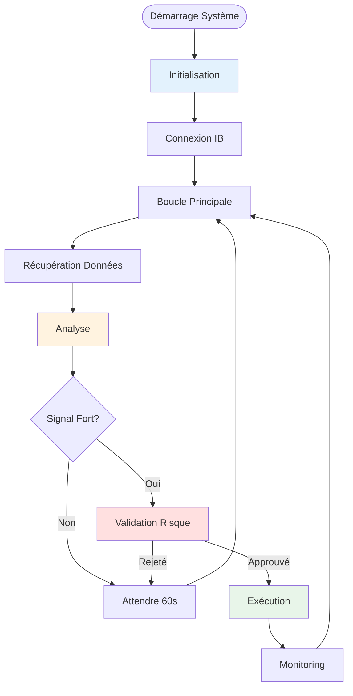

---

## Phase 1 : Initialisation 🚀

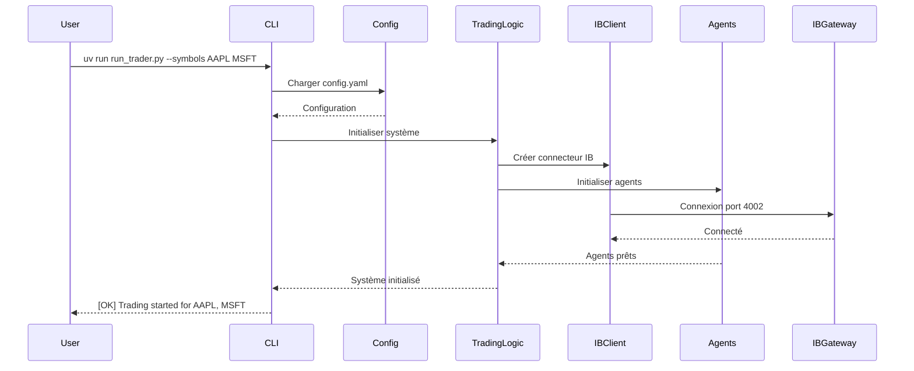

### Étapes

1. **Chargement configuration**
   ```python
   config = yaml.safe_load('src/config/config.yaml')
   ```

2. **Vérification prérequis**
   - IB Gateway est lancé ✓
   - API activée ✓
   - Port accessible ✓

3. **Initialisation composants**
   - `IBClient` : Connexion Interactive Brokers
   - `TradingSystemDSPy` : Système multi-agents
   - `RiskValidator` : Validateur de risques
   - `TradeExecutor` : Exécuteur d'ordres

4. **Connexion IB**
   ```python
   ib_client.connect('127.0.0.1', 4002, clientId=1)
   ```

5. **Démarrage boucle**
   ```python
   while True:
       process_trading_cycle()
       time.sleep(60)  # Attendre 60 secondes
   ```

---

## Phase 2 : Récupération des Données 📊

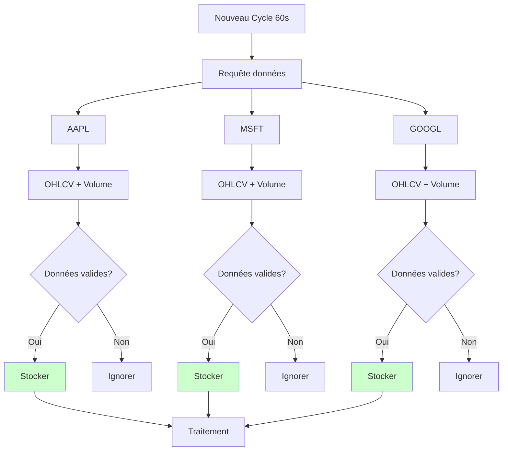

### Données Récupérées

Pour chaque symbole :

| Donnée | Description | Utilisation |
|--------|-------------|-------------|
| **Open** | Prix d'ouverture | Calcul range journalier |
| **High** | Prix le plus haut | Bollinger Bands, ATR |
| **Low** | Prix le plus bas | Bollinger Bands, ATR |
| **Close** | Prix de clôture | Tous les indicateurs |
| **Volume** | Volume échangé | Confirmation signaux |
| **Timestamp** | Horodatage | Suivi temporel |

### Exemple

```json
{
  "symbol": "AAPL",
  "timestamp": "2026-02-20T16:30:00Z",
  "data": {
    "open": 149.50,
    "high": 151.20,
    "low": 148.80,
    "close": 150.75,
    "volume": 45_320_000
  }
}
```

---

## Phase 3 : Analyse Multi-Agents 🤖

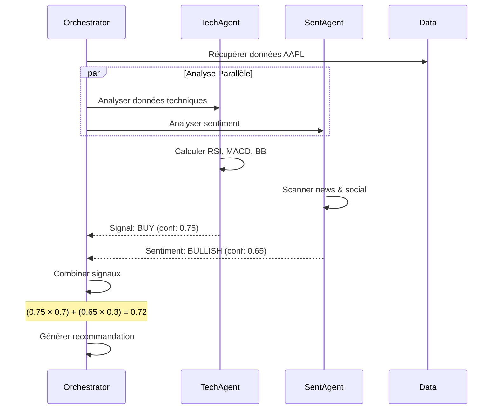

### Analyse Technique

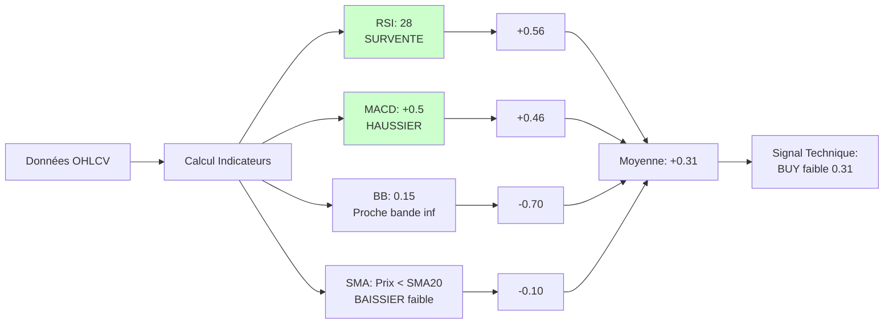

### Analyse Sentiment

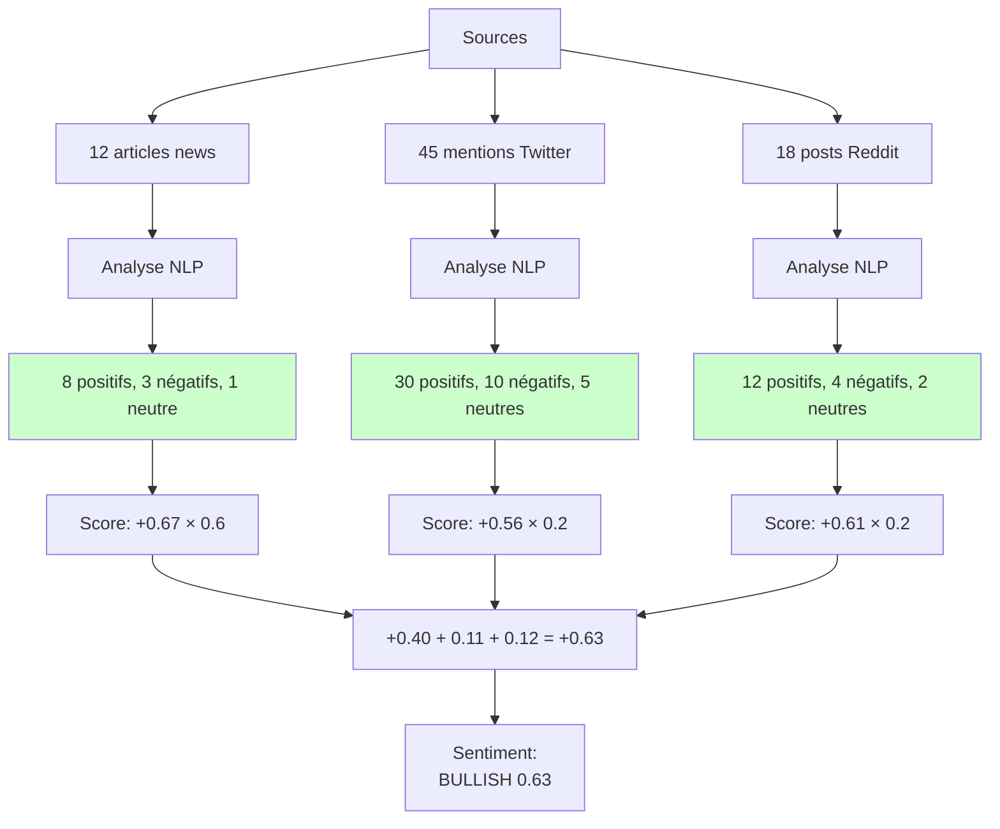

### Combinaison

```python
# Poids configurables
weight_technical = 0.7
weight_sentiment = 0.3

# Signaux individuels
signal_tech = 0.31
signal_sent = 0.63

# Signal combiné
signal_combined = (signal_tech * weight_technical) +
                 (signal_sent * weight_sentiment)
# = (0.31 × 0.7) + (0.63 × 0.3)
# = 0.217 + 0.189
# = 0.41

# Seuil de décision
threshold = 0.65

if signal_combined >= threshold:
    decision = "ACHAT"
elif signal_combined <= -threshold:
    decision = "VENTE"
else:
    decision = "ATTENTE"  # 0.41 < 0.65 → ATTENTE
```

---

## Phase 4 : Décision et Validation 🛡️

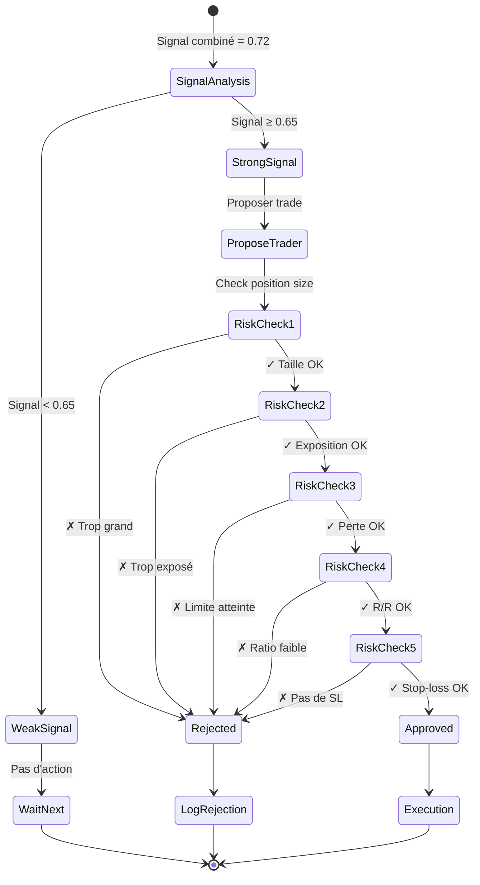

### Calcul des Paramètres de Trade

```python
# Signal fort détecté : ACHAT AAPL
symbol = "AAPL"
signal = 0.72  # Fort signal d'achat
current_price = 150.00

# 1. Calcul stop-loss (ATR)
atr = 2.50
stop_loss = current_price - (atr * 2)  # 150 - 5 = 145

# 2. Calcul take-profit (ratio 3:1)
risk_per_share = current_price - stop_loss  # 5
target_ratio = 3.0
take_profit = current_price + (risk_per_share * target_ratio)
# = 150 + (5 × 3) = 165

# 3. Calcul taille position
capital = 100_000
risk_per_trade = 0.01  # 1%
max_risk = capital * risk_per_trade  # 1000
quantity = max_risk / risk_per_share  # 1000 / 5 = 200

# 4. Limiter par max_position_size
quantity = min(quantity, 100)  # 100 actions max

# Paramètres finaux
trade_params = {
    'symbol': 'AAPL',
    'action': 'BUY',
    'quantity': 100,
    'price': 150.00,
    'stop_loss': 145.00,
    'take_profit': 165.00,
    'risk': 500,      # 100 × 5
    'reward': 1500    # 100 × 15
}
```

---

## Phase 5 : Exécution ⚡

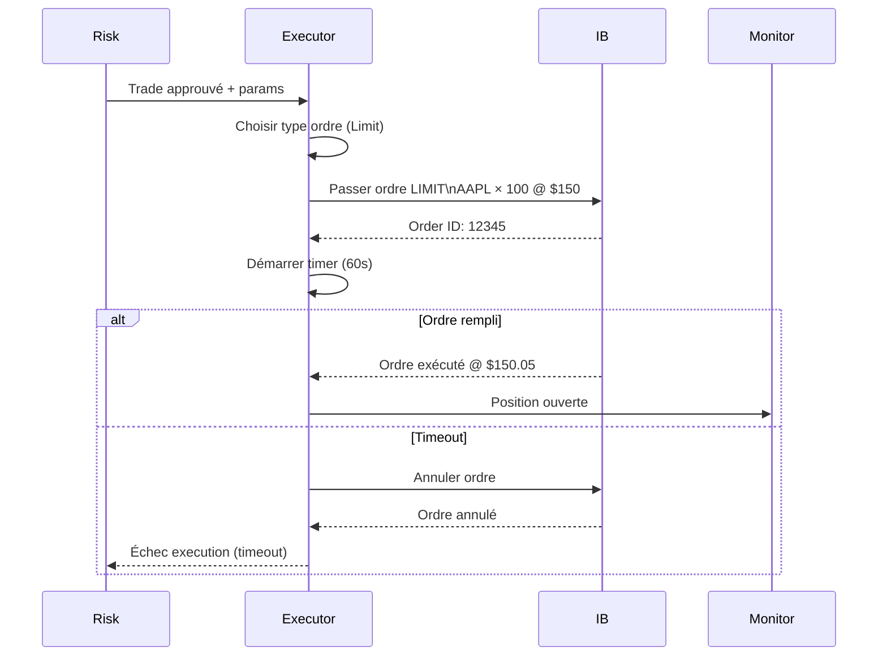

### Types d'Ordres

#### 1. Market Order (Immédiat)

```python
order = {
    'type': 'MARKET',
    'symbol': 'AAPL',
    'quantity': 100,
    'action': 'BUY'
}

# Exécution immédiate au meilleur prix disponible
# Risque: slippage (prix différent de prévu)
```

#### 2. Limit Order (Contrôlé)

```python
order = {
    'type': 'LIMIT',
    'symbol': 'AAPL',
    'quantity': 100,
    'action': 'BUY',
    'limit_price': 150.00,
    'timeout': 60  # secondes
}

# Exécution uniquement à $150 ou mieux
# Avantage: contrôle du prix
# Risque: ordre non rempli
```

### Gestion du Slippage

```mermaid
graph TB
    Order[Ordre Limit @ $150] --> Wait[Attente exécution]

    Wait --> Filled{Ordre rempli?}

    Filled -->|@ $150.00| Perfect[✓ Prix parfait\nSlippage: 0%]
    Filled -->|@ $150.10| Acceptable[✓ Acceptable\nSlippage: 0.07%]
    Filled -->|@ $150.25| Excessive[✗ Trop élevé\nSlippage: 0.17%]
    Filled -->|Non rempli| Timeout[Timeout 60s]

    Excessive --> Cancel[Annuler]
    Timeout --> Cancel

    Perfect --> Confirm[Confirmer trade]
    Acceptable --> Confirm

    style Perfect fill:#00cc00
    style Acceptable fill:#ccffcc
    style Excessive fill:#ffcccc
```

---

## Phase 6 : Monitoring et Gestion 📈

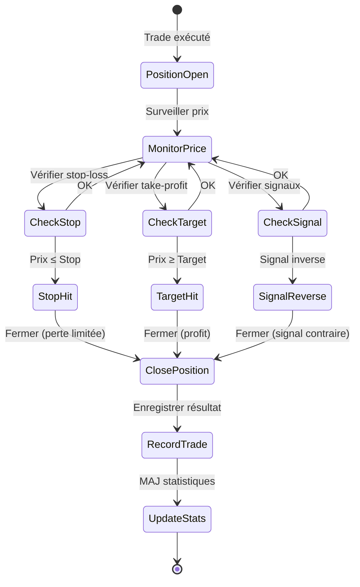

### Exemple Complet

```mermaid
gantt
    title Cycle de Vie Trade AAPL
    dateFormat HH:mm
    axisFormat %H:%M

    section Analyse
    Récupération données     :done, 09:30, 1m
    Analyse technique        :done, 09:31, 2m
    Analyse sentiment        :done, 09:31, 2m
    Combinaison signaux      :done, 09:33, 1m

    section Validation
    Validation risque        :done, 09:34, 1m
    Calcul paramètres        :done, 09:35, 1m

    section Exécution
    Passage ordre            :active, 09:36, 2m
    Position ouverte         :crit, 09:38, 120m

    section Monitoring
    Surveillance continue    :09:38, 120m
    Stop-loss atteint        :milestone, 11:38, 0m

    section Clôture
    Fermeture position       :11:38, 1m
    Enregistrement           :11:39, 1m
```

**Détails** :
- 09:30 : Récupération données AAPL
- 09:33 : Signal combiné = 0.72 (BUY)
- 09:35 : Trade validé (100 actions @ $150, SL $145)
- 09:38 : Position ouverte
- 11:38 : Stop-loss atteint @ $145
- **Résultat** : -$500 (100 × -$5)

---

## Cycle Complet Résumé

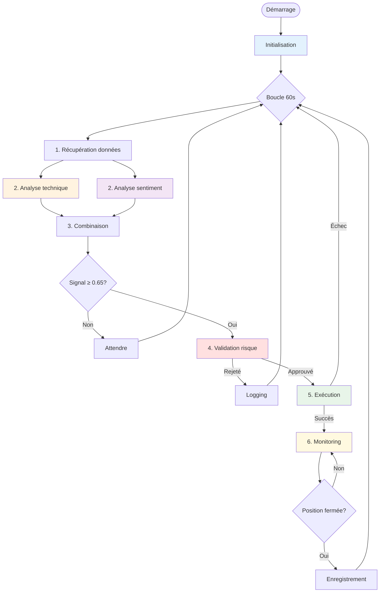

---

## Métriques et Logging

### Données Enregistrées

Pour chaque cycle :
```json
{
  "timestamp": "2026-02-20T09:30:00Z",
  "symbol": "AAPL",
  "signal_technical": 0.75,
  "signal_sentiment": 0.65,
  "signal_combined": 0.72,
  "decision": "BUY",
  "risk_validation": "APPROVED",
  "execution": "SUCCESS",
  "entry_price": 150.05,
  "stop_loss": 145.00,
  "take_profit": 165.00,
  "quantity": 100
}
```

Pour chaque trade fermé :
```json
{
  "trade_id": "12345",
  "open_time": "2026-02-20T09:38:00Z",
  "close_time": "2026-02-20T11:38:00Z",
  "symbol": "AAPL",
  "quantity": 100,
  "entry_price": 150.05,
  "exit_price": 145.00,
  "pnl": -505.00,
  "pnl_percent": -3.36,
  "exit_reason": "STOP_LOSS",
  "duration_minutes": 120
}
```

---

**Navigation**
- [← Architecture](./ARCHITECTURE.md)
- [← Système Multi-Agents](./AGENTS_SYSTEM.md)
- [← Indicateurs Techniques](./INDICATORS.md)
- [← Gestion des Risques](./RISK_MANAGEMENT_DETAILED.md)
- [→ Configuration](./CONFIGURATION.md)
